# BRAW Toolbox

BRAW Toolbox allows you to import Blackmagic RAW files directly into Final Cut Pro without transcoding.

This allows you to do your offline edit in Final Cut Pro, then send across to DaVinci Resolve for grading - all using BRAW files directly from the camera!

---

## Download

BRAW Toolbox is currently in **public beta**. There are currently 140+ testers from all over the world.

**You can download the latest beta via Apple's TestFlight [here](https://testflight.apple.com/join/dbWjWl8e).**

If all goes to plan, we intend to release on the Mac App Store in late January.

TestFlight requires macOS Monterey or later. However, if you're running Big Sur, it MIGHT be possible to download on a Monterey machine, then copy across to your Big Sur machine, if they share the same Apple ID.

---

## Sample BRAW Clips

There are heaps of awesome clips to test with on the Blackmagic Website:

- [Blackmagic Pocket Cinema Camera Gallery](https://www.blackmagicdesign.com/au/products/blackmagicpocketcinemacamera/gallery)
- [Blackmagic URSA Mini Gallery](https://www.blackmagicdesign.com/au/products/blackmagicursaminipro/gallery)

---

## Help & Support

If you run into any bugs, crashes, or you have a feature request, you can post an issue [here](https://github.com/latenitefilms/BRAWToolbox/issues).

If you have any general questions or feedback, you can discuss [here](https://github.com/latenitefilms/BRAWToolbox/discussions).

GitHub registration is free, and this GitHub repository is actively monitored by [latenitefilms](https://github.com/latenitefilms).

---

## Incomplete Features

The below features are not yet available in the latest beta, and will be added prior to release on the Mac App Store:

- The **Relink Unliked BRAW Clips within an EVENT** Toolbox feature is not yet enabled
- The **Convert BRAW clips to MOV's within an EVENT** Toolbox feature is not yet enabled

---

## Release Notes

### 1.0.0 (22) - Public Beta 9 - 15th January 2023

**Note:**
- There are no changes to the Motion Template, Metadata View or LUTs in this beta.

**Bug Fix:**
- Still attempting to fix issues with rendering on Mac Pro's with Dual GPUs. Thanks for reporting Jamie Lejeune & [@tangierc](https://github.com/tangierc)!
- If you also have a Mac Pro with Dual GPUs and have any rendering glitches or issues, please let us know [here](https://github.com/latenitefilms/BRAWToolbox/issues/25).

### 1.0.0 (21) - Public Beta 8 - 15th January 2023

**Note:**
- There are no changes to the Motion Template, Metadata View or LUTs in this beta.

**Bug Fix:**
- Still attempting to fix issues with rendering on Mac Pro's with Dual GPUs. Thanks for reporting Jamie Lejeune & [@tangierc](https://github.com/tangierc)!
- If you also have a Mac Pro with Dual GPUs and have any rendering glitches or issues, please let us know [here](https://github.com/latenitefilms/BRAWToolbox/issues/25).

### 1.0.0 (20) - Public Beta 7 - 14th January 2023

**Note:**
- The Motion Templates and Metadata View has been updated in this release. You now also need to install the LUTs when you first run the application (used for HDR).
- We no longer store the Metadata View in the `/Library/Application Support/ProApps/Metadata Definitions/` folder - it's now stored in the user library. You should **manually** delete the `BRAW Toolbox.plist` file in this folder if you've used earlier beta builds.

**Improvements:**
- We've re-designed the Metal pipeline, to HOPEFULLY improve performance on older 2013 Mac Pro's with Dual AMD FirePro D500. These changes MIGHT also improve performance on other systems. Thanks for reporting [@tangierc](https://github.com/tangierc)!
- Thanks to the amazing Marc Bach & Jamie Lejeune, we've redesigned how BRAW Toolbox handles HDR content, so it better matches DaVinci Resolve.
- There are now **Color Space** settings in the **Settings** button (the gear icon) within the Workflow Extension. This controls the Player in the Workflow Extension, and also the settings of the Synchronised Clips or Multicam Clips that are imported into Final Cut Pro.
- If you select the **DaVinci Wide Gamut** Color Space/Gamut and **DaVinci Intermediate** Gamma, there's now also an option within the Settings button to enable a special LUT which gets applied within Final Cut Pro (the effect of the LUT isn't visible in the Workflow Extension) to better match DaVinci Resolve. Using this option with a **Wide Gamut HDR - Rec. 2020 PQ** Library & Project is the recommended way to grade HDR BRAW in Final Cut Pro.
- Added settings to select the **Default Decode Quality**.
- The thumbnails for the Effects within Final Cut Pro have been improved so they look nicer.
- The BRAW Toolbox Metadata View now contains additional built-in fields, that are used by Sync-N-Link.

**Bug Fixes:**
- We now remember the Audio Folder if you click **Prepare BRAW Files** before clicking **Choose Audio Folder**.
- Fixed a regression which broke the **Remove All** button.

### 1.0.0 (19) - Public Beta 6 - 7th January 2023

**Note:**
- There are no changes to the Motion Template or Metadata View in this beta.

**Improvements:**
- Added a **Settings** button (the gear icon), with the ability to **Create Multicam Clips** instead of Synchronised Clips. Thanks for suggesting [@TheDaveChap](https://github.com/TheDaveChap)!
- **Convert PROJECT to Resolve Friendly FCPXML** has been improved so that Audio Attributes and Rate Conform settings come across more accurately between Final Cut Pro and DaVinci Resolve. Thanks for reporting [@markspen](https://github.com/markspen)!
- If the Color Space is set to **Rec.2020**, and the Gamma is set to **Rec.2100 ST2084 (PQ)** in the Workflow Extension, we'll use the **Rec. 2020 PQ** setting for this clip in Final Cut Pro. Thanks for suggesting [@JW144754](https://github.com/JW144754)!
- If the Color Space is set to **Rec.2020**, and the Gamma is set to **Rec.2100 Hybrid Log Gamma** in the Workflow Extension, we'll use the **Rec. 2020 HLG** setting for this clip in Final Cut Pro. Thanks for suggesting [@JW144754](https://github.com/JW144754)!
- If the Color Space is set to **Rec.2020**, and the Gamma is set to something other than PQ or HLG in the Workflow Extension, we'll use the **Rec. 2020** setting  for this clip in Final Cut Pro. Thanks for suggesting [@JW144754](https://github.com/JW144754)!

**Bug Fixes:**
- Fixed a bug where clicking the **Gamma** checkbox, and then **Apply Checked To All** would fail.

### 1.0.0 (18) - Public Beta 5 - 6th January 2023

**Note:**
- There are no changes to the Motion Template or Metadata View in this beta.

**Bug Fix:**
- Fixed a bug where we were releasing `copiedParameters` incorrectly when the Workflow Extension was closed.

### 1.0.0 (17) - Public Beta 4 - 6th January 2023

**Note:**
- There are no changes to the Motion Template or Metadata View in this beta.

**Improvements:**
- Renamed the **Clear BRAW Files** button to **Remove All** and added a **Remove Selected** button. Thanks for suggesting [@TheDaveChap](https://github.com/TheDaveChap)!
- Added ability to drag-and-drop BRAW files from Finder into the BRAW Toolbox Workflow Extension. Thanks for suggesting [@TheDaveChap](https://github.com/TheDaveChap)!
- Left-aligned the buttons in the Final Cut Pro Inspector so they don't exhibit any weird UI glitches. Thanks for suggesting [@JW144754](https://github.com/JW144754)!
- Sliders in the Workflow Extension are now all continuous, and update the Viewer instantly.
- Added Tooltips to the Workflow Extension.

### 1.0.0 (16) - Public Beta 3 - 5th January 2023

**Note:**
- There are no changes to the Motion Template or Metadata View in this beta.

**Bug Fixes:**
- Fixed a weird bug which caused the **Preparing BRAW Files** to never close on Intel Mac's (but worked fine on Apple Silicon Mac's). Thanks for reporting [George Elias](https://twitter.com/gwphotographe)!
- Increased the Workflow Extension height by a tiny amount so it looks better on Intel Mac's.

### 1.0.0 (15) - Public Beta 2 - 5th January 2023

**Important:**
- Due to major changes, this beta is **not** compatible with the previous beta, so you should re-create any test Final Cut Pro libraries.
- If you have installed and used the previous beta, you will need to install the new Motion Template and Metadata View, prior to launching Final Cut Pro.

**Improvements:**
- The BRAW Toolbox Motion Template has been completely redesigned to be a lot faster and easier to use. We have removed all the override controls. It now only shows the parameters that you can control (i.e. if your camera doesn't allow manipulating the ISO, we no longer show this parameter).
- We added a **Global Settings** button to the Motion Template in the Final Cut Pro Inspector, so that you can force a Decode Quality across all clips. This is useful if you have clips with different Decode Quality settings, but you want to export at the highest quality.
- We now populate the **Ingest Date** (aka "Date Imported" in Final Cut Pro) metadata field. Thanks for suggesting [@tangierc](https://github.com/tangierc)!
- The Workflow Extension has been redesigned. The checkboxes no longer act as "overrides", but instead allow you to select which parameters you want to copy, paste, etc.
- The buttons at the bottom of the Workflow Extension Inspector (Copy, Paste, etc.) now all work.
- All the parameters in the Workflow Extension should now flow into Final Cut Pro.
- All the parameters in the Final Cut Pro Inspector should now work and update correctly. Thanks for reporting [@markspen](https://github.com/markspen)!
- We now display an error message if you press **Show Parameters** with no BRAW file loaded.
- We no longer hide the Workflow Extension player slider when playing, and now update its value during playback. Thanks for suggesting @JW144754!
- The Viewer in the Workflow Extension is now resizable. Thanks for suggesting [@JW144754](https://github.com/JW144754)!
- The main application now only asks for permissions to your Movies folder and Application Support folder once.
- All the individual open/save dialog boxes now remember their own last opened path.
- The **Convert PROJECT to Resolve Friendly FCPXML** Toolbox now works.
- We've added a loading screen when BRAW Toolbox is Preparing BRAW Files. Thanks for suggesting [@tangierc](https://github.com/tangierc)!

**Changes:**
- We now write log files to `/Users/YOUR-USER-NAME/Library/Group Containers/A5HDJTY9X5.com.latenitefilms.BRAWToolbox/Library/Application Support/` folder, for easier debugging.
- BRAW Toolbox will now run on macOS Big Sur and above.

**Bug Fixes:**
- Fixed various memory leaks.
- Fixed a bug which prevented the correct Decode Quality from being used. Thanks for reporting [@JW144754](https://github.com/JW144754)!
- Fixed a bug in the ISO parameter.
- Error messages in Final Cut Pro now show the correct icon.
- Added some missing Metadata Definition labels.

### 1.0.0 (14) - Public Beta 1 - 23rd December 2022

This is the first public beta of BRAW Toolbox. Woohoo!

This build is very much a work-in-progress, and doesn’t contain all our latest code (due to delays and complexity of getting things approved by Apple’s App Review). However, now that the first beta is out, we hope to be able to push out new builds much more quickly in the New Year, as we work towards a public release.

The main area we’d like to test at this point is making sure that all machines can successfully import and playback BRAW files. Currently we’ve been primarily testing on MacBook Pro’s (16-inch, 2021, M1 Max, 64GB RAM) running macOS Monterey and Final Cut Pro 10.6.5. We're particularly interested to see how things work on MacPro's with multiple GPUs.

The Workflow Extension is currently very incomplete. All of the parameters from Color Science Version onwards currently don’t come across to Final Cut Pro. The buttons at the bottom of the parameters also don’t currently do anything. The Toolbox currently doesn’t do anything.

Happy testing!

---

## Installation

You first need to join the TestFlight Beta by clicking on [this invite](https://testflight.apple.com/join/dbWjWl8e).

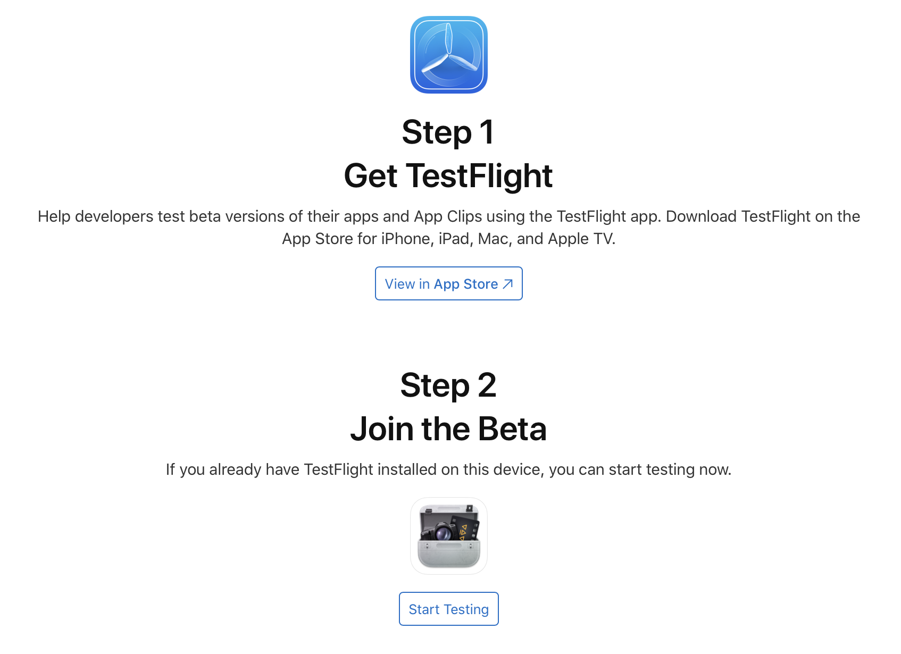

Once you've installed TestFlight and clicked on the above link, you will see BRAW Toolbox within the TestFlight application.

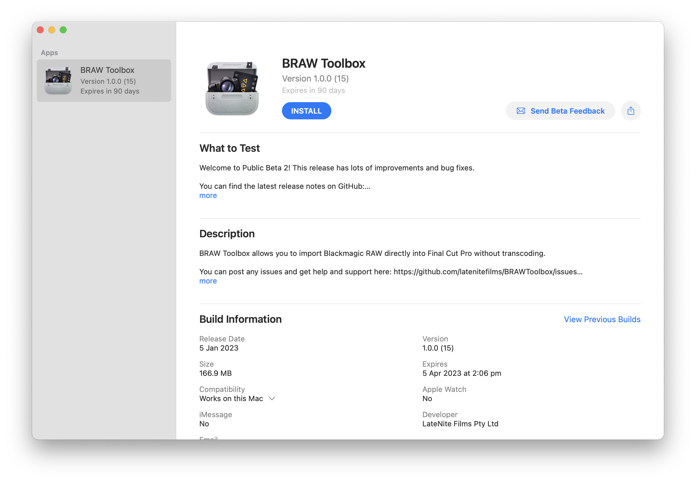

After you click the **INSTALL** button, the main BRAW Toolbox application will run.

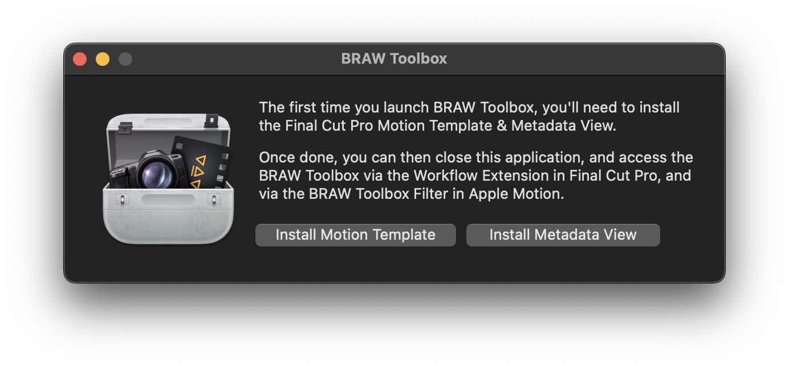

If it's the first time installing the software, or if there's been an update, you'll be prompted to **Install Motion Template** and **Install Metadata View**.

Once you click the button, you'll be prompted to grant permission to your Movies folder. This is due to macOS's sandboxing, and you'll only need to do this once. Click **OK**.

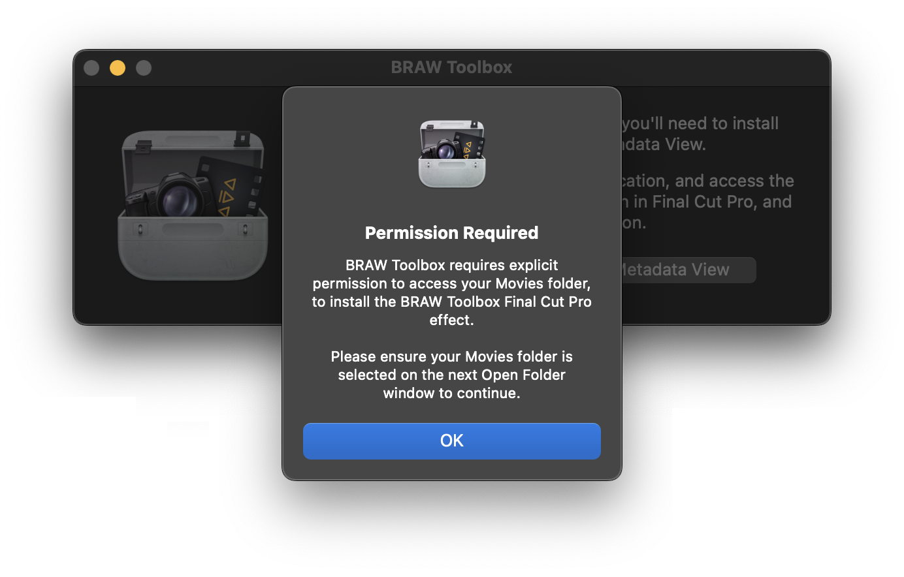

You then need to click **Grant Access**:

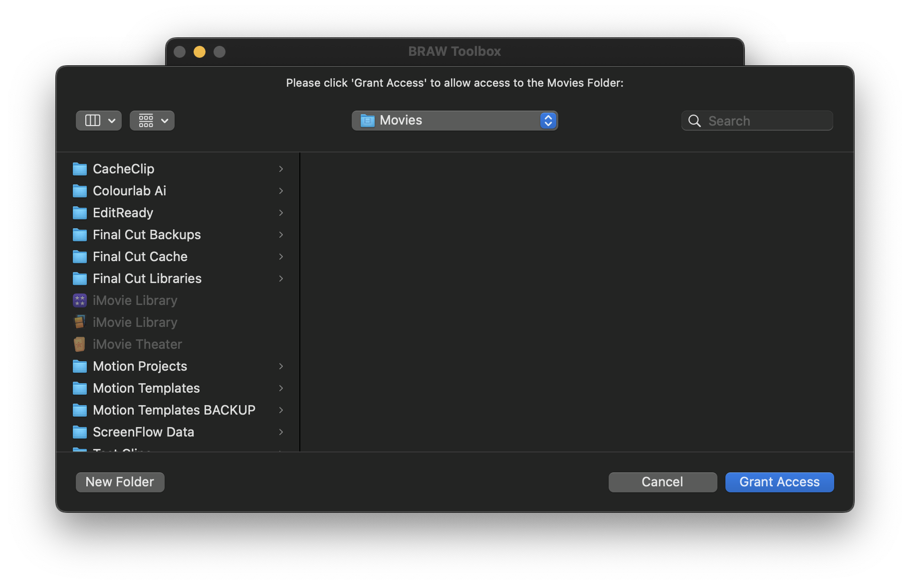

Once done, you'll be presented with a successful message:

The button will now be disabled, and will say **Motion Template Installed**.

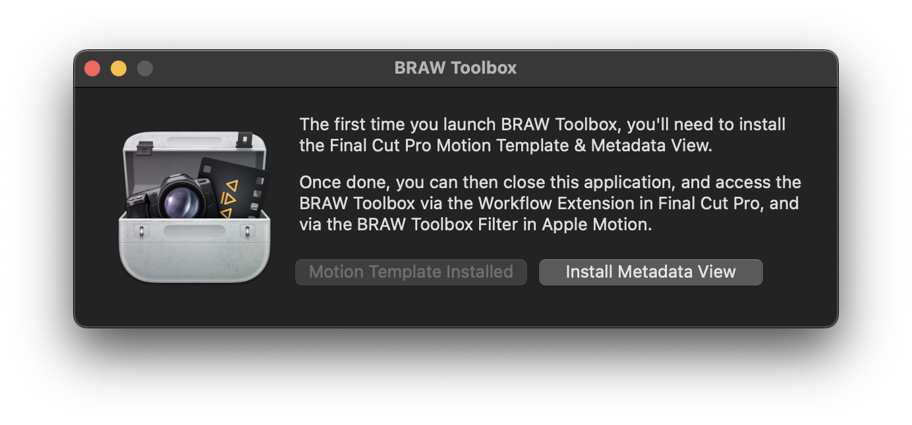

You should now click the **Install Metadata View** button, and you'll be prompted to grant permission to your ProApps folder.

You need to click the **Grant Access** button:

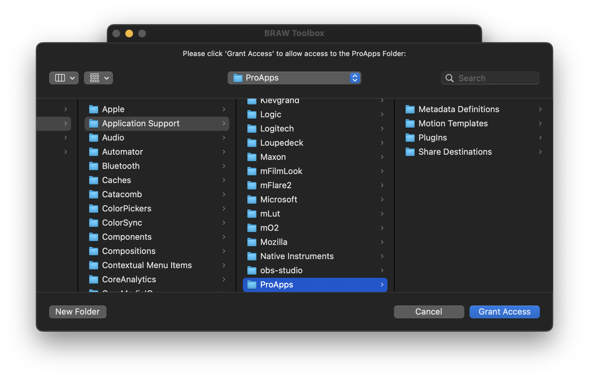

Once done, you'll be presented with a successful message:

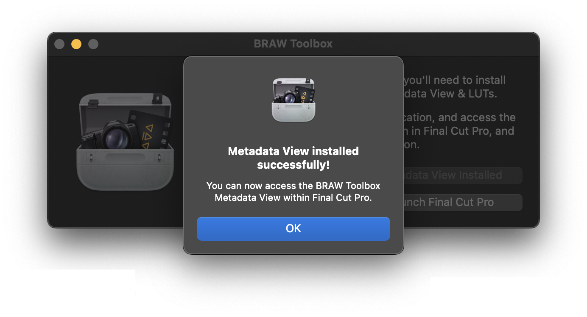

The button will now be disabled, and will say **Metadata View Installed**.

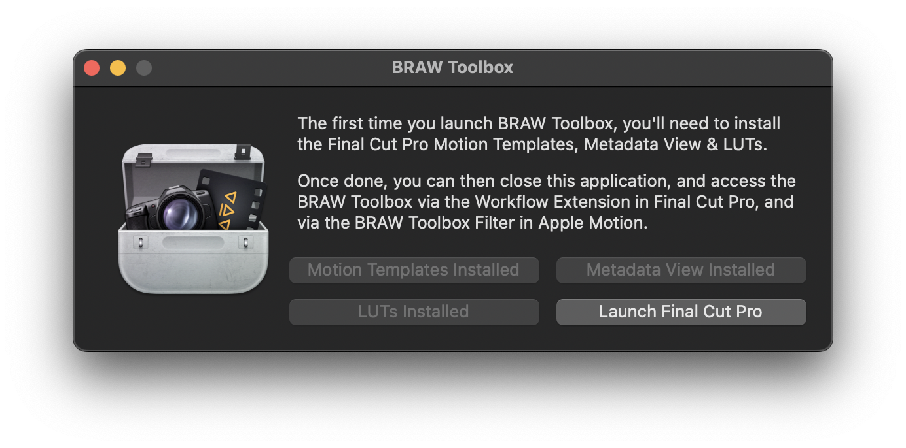

You can now close the BRAW Toolbox application and open Final Cut Pro.

**IMPORTANT:** You should run the BRAW Toolbox application again after each update, to make sure you're using the latest Motion Template and Metadata View.

Once Final Cut Pro is launched you can access BRAW Toolbox via the Workflow Extension button:

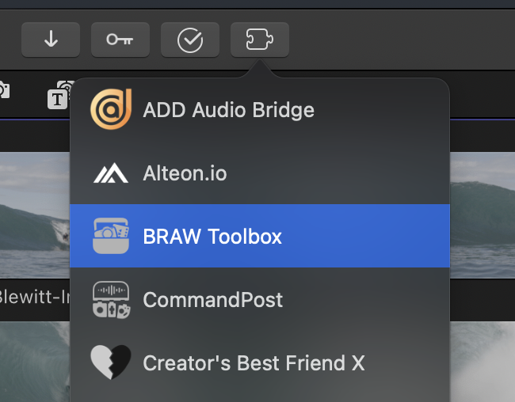

...and via the **Window > Extensions > BRAW Toolbox** menu item:

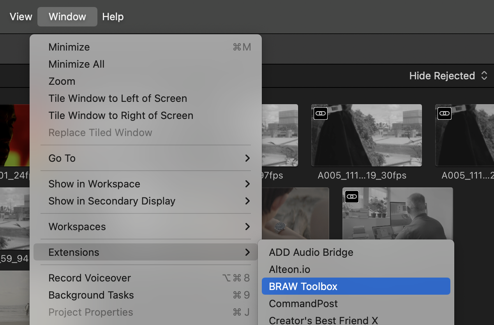

When you click either of those options it opens the BRAW Toolbox Workflow Extension:

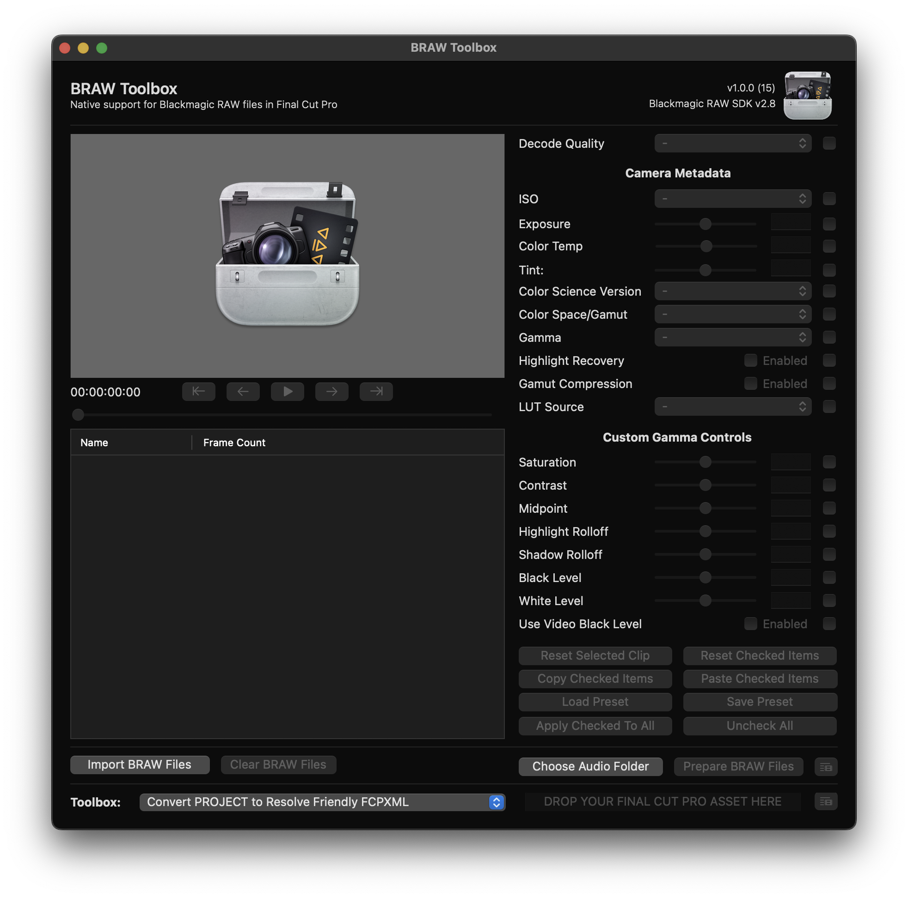

To import some BRAW clips, click the **Import BRAW Files** button and select some BRAW clips.

You can now adjust all the metadata as required. There are tools for easily copy and pasting RAW parameters between clips.

Whilst BRAW Toolbox can play back BRAW video files natively, to handle audio, it "extracts" the audio prior to sending to Final Cut Pro. You should press the **Choose Audio Folder** button to select the destination folder for these audio files.

Once you've tweaked any metadata settings, you can press the **Prepare BRAW Files** to get everything ready for Final Cut Pro. Once it's processed, you'll get this alert explaining what to do next:

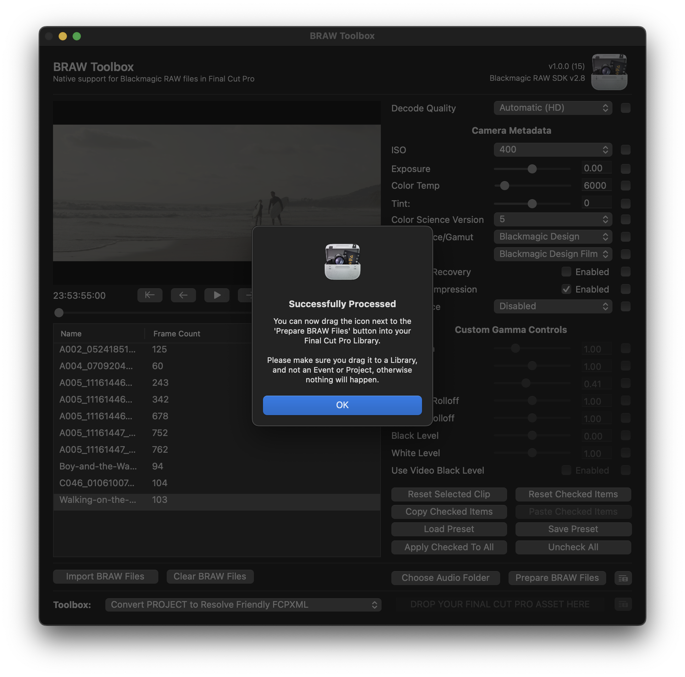

Essentially, you need to drag this button:

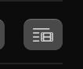

...to your Final Cut Pro **Library** (**not** an Event or Project). This will create a new Keyword Collection with your BRAW clips:

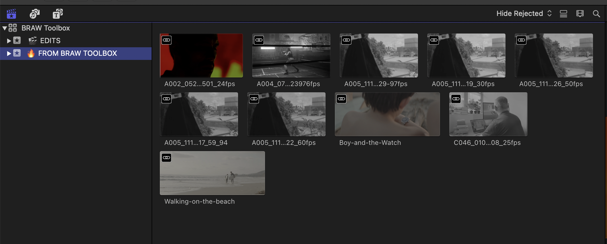

To modify the metadata of a BRAW clip, you can double click on one of the synchronised clips, click on the black video clip, then access the BRAW Toolbox effect in the Effects section of the Inspector:

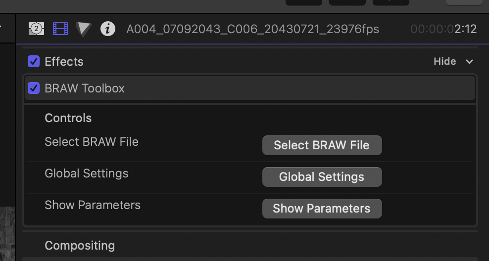

Click the **Show Parameters** button to show the parameters. You'll only have to do this once per clip.

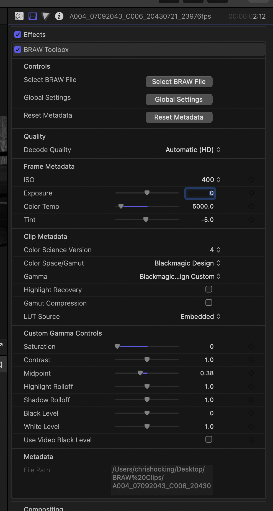

Frame metadata and Custom Gamma Controls are key-frame-able.

You can only access Custom Gamma Controls if you have the **Blackmagic Design Custom** gamma parameter selected.

You can now edit BRAW files like any other camera media in Final Cut Pro.

---

## Convert PROJECT to Resolve Friendly FCPXML

To convert a project/timeline into something you can easily import into DaVinci Resolve (or other colour grading apps), you can drag your project from the Final Cut Pro Browser to the Toolbox at the bottom of the Workflow Extension.

This will create a new FCPXML, where it converts the BRAW Toolbox clips into normal BRAW clips.

---

## Frequently Asked Questions

### Does BRAW Toolbox work with Sync-N-Link?

Yes, BRAW Toolbox is compatible with **Sync-N-Link v1.1.4** on the Mac App Store.

You should use Synchronised Clips in BRAW Toolbox, and it can combine multiple clips with location audio into a multicam.

### BRAW Toolbox Workflow Extension doesn't appear in Final Cut Pro?

Sometimes macOS can be a bit temperamental with System Extensions, including Workflow Extensions.

If you can't see BRAW Toolbox in the Workflow Extension button or menu bar, you can try:

1. Restart your Mac.
2. [Trash Final Cut Pro Preferences](https://support.apple.com/en-au/HT203477) by holding down COMMAND + OPTION when launching Final Cut Pro.
3. Delete Final Cut Pro and reinstall it from the App Store.

If none of those things fix it, please post an issue [here](https://github.com/latenitefilms/BRAWToolbox/issues).

### I don't like Synchronised Clips. Can I import a Multicam clips instead?

Yes, you can click the **Settings** button (the gear icon, next to "Remove All") to **Create Multicam Clips** instead.

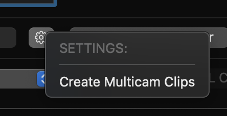

### Why can't I adjust the Custom Gamma Controls?

You can only adjust the Custom Gamma Controls if you select the **Blackmagic Design Custom** Gamma option.

### Can I stabilise clips using the Gyroscope Data within the BRAW file?

Yes, you can combine BRAW Toolbox with [Gyroflow Toolbox](https://github.com/latenitefilms/GyroflowToolbox) - simply apply the Gyroflow Toolbox effect to the video layer inside your Synchronised or Multicam clip.

### How much will BRAW Toolbox cost?

We're not sure yet. We just want to get through the beta testing phase before deciding on a price. It'll depend on how much work is involved to update and support the software.

### Is BRAW Toolbox Open Source?

Currently the source code for BRAW Toolbox is private, however we may release it under a MIT License at a later date after it's been publicly released on the Mac App Store.

### I've run into a bug. Where can I find the log files?

You can find the log files here:

`/Users/YOUR-USER-NAME/Library/Group Containers/A5HDJTY9X5.com.latenitefilms.BRAWToolbox/Library/Application Support/`

You can find any crash reports here:

`/Users/YOUR-USER-NAME/Library/Logs/DiagnosticReports`

---

## Credits

BRAW Toolbox has been thrown together by [Chris Hocking](https://github.com/latenitefilms) at [LateNite Films](https://latenitefilms.com).

Chris also created [CommandPost](https://commandpost.io) and [Gyroflow Toolbox](https://github.com/latenitefilms/GyroflowToolbox).

The BRAW Toolbox icon was designed by the amazing [Matthew Skiles](http://matthewskiles.com).
