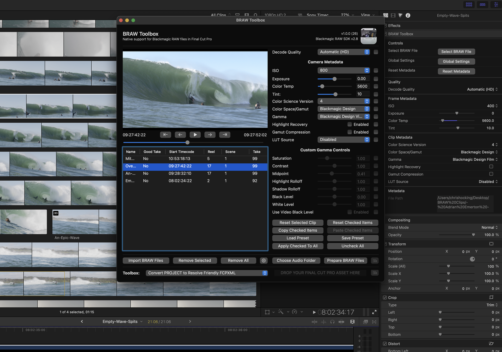

# BRAW Toolbox

> :icon-trophy: Thanks to everyone who helped us reach #1 in the 'Photo & Video' category on the Australian Mac App Store!

BRAW Toolbox allows you to import Blackmagic RAW files directly into Final Cut Pro **without transcoding**.

**_No more transcoding. No more waiting. No more massive ProRes files._**

The BRAW Toolbox Workflow Extension allows you to prepare all your footage prior to import, allowing you to easily and quickly change all the RAW metadata, and copy and paste metadata from different BRAW clips. You can even save Presets for specific Metadata Attributes.

Once imported into Final Cut Pro, you can still modify the RAW metadata at any time - and you can even keyframe the ISO, Exposure, Color Temp and Tint.

BRAW Toolbox comes with a Metadata View that allows you to view every piece of BRAW Metadata directly within the Final Cut Pro Inspector.

There are automatic Decode Quality options for both HD and UltraHD projects, and you can also work at a low quality Decode Quality, then apply a "Global Setting" to force Full Quality prior to export. BRAW Toolbox gives you complete freedom and flexibility.

You can also use the Workflow Extension to send your project/timeline to DaVinci Resolve for grading - all using BRAW files directly from the camera!