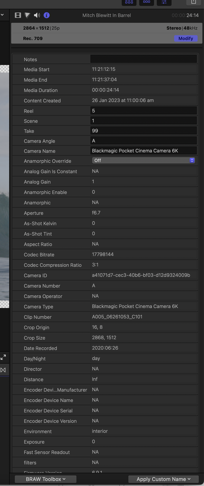

# BRAW Toolbox

BRAW Toolbox allows you to import Blackmagic RAW files directly into Final Cut Pro **without transcoding**.

**_No more transcoding. No more waiting. No more massive ProRes files._**

> [:icon-desktop-download: **Click here to buy on the Mac App Store**](https://apps.apple.com/au/app/braw-toolbox/id6444061549?mt=12)

---

## Prepare Your Footage

Our Workflow Extension allows you to prepare all your footage prior to import, allowing you to easily and quickly change all the RAW parameters, and copy and paste attributes from different BRAW clips.

You can even save Presets for specific Metadata Attributes.

---

## Full RAW Control

Once imported into Final Cut Pro, you can still modify the RAW parameters at any time - and you can even keyframe the ISO, Exposure, Color Temp, Tint and Custom Gamma Controls!

There are automatic Decode Quality options for both HD and UltraHD projects, and you can also work at a low quality Decode Quality, then apply a **Global Setting** to force Full Quality prior to export. BRAW Toolbox gives you complete freedom and flexibility.

---

## Powerful Metadata

BRAW Toolbox comes with a Metadata View that allows you to view every piece of BRAW Metadata directly within the Final Cut Pro Inspector.

---

## Send to DaVinci Resolve

You can also use the Workflow Extension to send your project/timeline to DaVinci Resolve for grading - all using BRAW files directly from the camera!

---

## Gyroscope Stabilisation

You can combine BRAW Toolbox with Gyroflow Toolbox to bring gyroscope stabilisation directly to Final Cut Pro!

---

## Number One

:icon-trophy: Thanks to everyone who helped us reach **#1** in the **Photo & Video** category on the Mac App Store at various places around the world during our first week!

> [:icon-desktop-download: **Click here to buy on the Mac App Store**](https://apps.apple.com/au/app/braw-toolbox/id6444061549?mt=12)