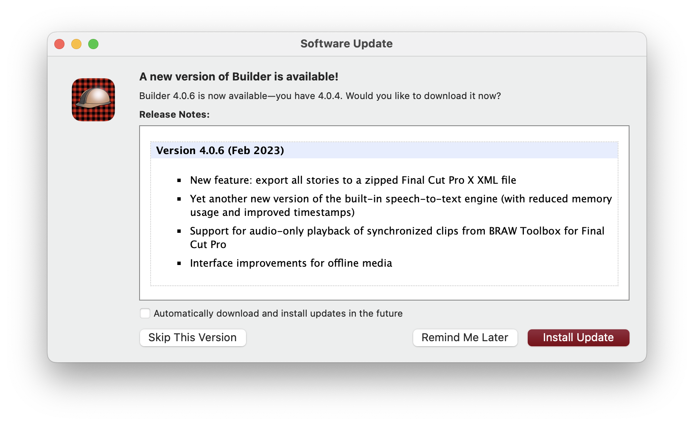

# Frequently Asked Questions

### Why BRAW Toolbox?

[Color Finale Transcoder](https://colorfinale.com/transcoder) allows you to convert BRAW files into ProRes quickly and easily, all via a very slick Workflow Extension. It's a great application that we highly recommend you purchase.

There's also the incredible [EditReady](https://hedge.video/editready) which is also fantastic at just converting BRAW to ProRes with lots of power and controls. Again, we recommend everyone purchases it.

And of course, DaVinci Resolve is free and even has the **Blackmagic Proxy Generator** app to easily convert BRAW to proxies.

However, the downside to having to transcode footage is that it **takes extra time**, and it **takes extra storage**.

As hardcore Final Cut Pro users, we got frustrated when clients would hand over SSDs with 2-4TB's worth of BRAW footage, that we'd need to convert to ProRes to start editing with it in Final Cut Pro.

Whilst we love and use DaVinci Resolve - Final Cut Pro is our editing tool of choice for many reasons, so we wanted a solution to allow us to access BRAW files natively.

For whatever reason, Apple doesn't have BRAW support high on the priority list, nor do they want to help Blackmagic impliment BRAW support in Final Cut Pro - so we took matters into our own hands.

Now we can just import BRAW files directly into Final Cut Pro, with full RAW controls, and access to all the camera metadata.

----

### How does it work?

Because Final Cut Pro's decode API is private - we had to just make do with the two public API's we had access to - [Workflow Extensions](https://developer.apple.com/documentation/professional_video_applications/workflow_extensions) and [FxPlug4](https://developer.apple.com/documentation/professional_video_applications/fxplug?language=objc).

We use the Workflow Extension API as our "user interface", where users can select the footage they want to import, and preset any RAW controls.

We use the FxPlug4 API as our "renderer". Essentially, BRAW Toolbox is just a Filter in Apple Motion, and an Effect in Final Cut Pro, but instead of "processing" the source clip, we replace the clip contents with the processed BRAW clip.

We use Blackmagic's official [BRAW SDK](https://www.blackmagicdesign.com/developer/product/camera) - so you get all the same colour science and processing speed as DaVinci Resolve.

As far as we know, BRAW Toolbox is the first application on the Mac App Store to include an FxPlug4 effect.

---

### Why the Mac App Store?

As end users, we love the Mac App Store, because when we purchase a new machine, all our previously purchased apps just auto-magically appear.

We also love the fact that if you have both a Desktop and a Laptop, you can just purchase once, and use the apps on both machines without any fuss.

The Mac App store is also very secure and highly trusted. Everything that's on the App Store is reviewed on multiple levels by Apple, and goes through a detailed App Review process.

As developers, the Mac App Store does have it's negatives - Apple takes a decent cut of all the payments, and there are very strict security and sandboxing requirements.

Even Final Cut Pro itself, isn't actually sandboxed - so we had to spend a lot of time, care and attention, making sure BRAW Toolbox works great in a locked-down sandboxed environment.

However, we think the pro's outweight the con's - and all the extra effort to make it App Store friendly was a worthwhile endeavour.

---

### Why is BRAW Toolbox so expensive?

BRAW Toolbox is a very niche app with a relatively small group of users, so we need to charge a reasonable amount to justify the continued support and development.

We spent over 225 hours developing version v1.0.0, and will continue to devote a lot of time to adding features and making it faster and more useful for Final Cut Pro editors.

It's also something that Apple will "Sherlock" eventually, as I'm sure native BRAW support is on their roadmap.

For the first week, we released BRAW Toolbox at 50% off as a small thank you to our early adopters who helped with beta testing and promoting BRAW Toolbox.

It was also available a few weeks prior to release as a pre-sale with the 50% discount.

You can find educational pricing [here](/educational).

We also support and encourage independent filmmakers and film school students to [reach out](/support) if cost becomes an issue.

You can always use [DaVinci Resolve](https://www.blackmagicdesign.com/products/davinciresolve) for free if you want to convert BRAW to ProRes to edit in Final Cut Pro.

We are also big fans of [Color Finale Transcoder](https://colorfinale.com/transcoder) and [EditReady](https://hedge.video/editready).

---

### Did you have Beta Testers?

Yes, prior to public release BRAW Toolbox was in a public beta from 23rd December 2022 to 30th January 2023, and an internal beta before that.

MASSIVE thanks to the **291 users** who took part in this extensive beta program!

We also occasionally post new TestFlight builds on the [Discussion](https://github.com/latenitefilms/BRAWToolbox/discussions) page as we test new features.

---

### Is BRAW Toolbox Open Source?

Currently the source code for BRAW Toolbox is closed/private, however we may release it under a MIT License at a later date if there's enough demand and interest.

However, if you're looking for an example FxPlug4 codebase, check out [Gyroflow Toolbox](https://github.com/latenitefilms/gyroflowtoolbox/).

---

### Where can I find some sample BRAW clips?

There are heaps of awesome clips to test with on the Blackmagic Website:

- [Blackmagic Pocket Cinema Camera Gallery](https://www.blackmagicdesign.com/au/products/blackmagicpocketcinemacamera/gallery)
- [Blackmagic URSA Mini Gallery](https://www.blackmagicdesign.com/au/products/blackmagicursaminipro/gallery)

---

### Does BRAW Toolbox work with Sync-N-Link?

Yes, BRAW Toolbox is compatible with **Sync-N-Link v1.1.4** or later on the Mac App Store.

You should use Synchronised Clips in BRAW Toolbox, and it can combine multiple clips with location audio into a multicam.

You can download Sync-N-Link [here](https://apps.apple.com/us/app/sync-n-link-x/id517599985?mt=12).

---

### Does BRAW Toolbox work with Lumberjack Builder?

Yes, BRAW Toolbox is compatible with **Lumberjack Builder v4.0.6** or later.

You can download Lumberjack Builder [here](https://www.lumberjacksystem.com/builder-nle-2/).

