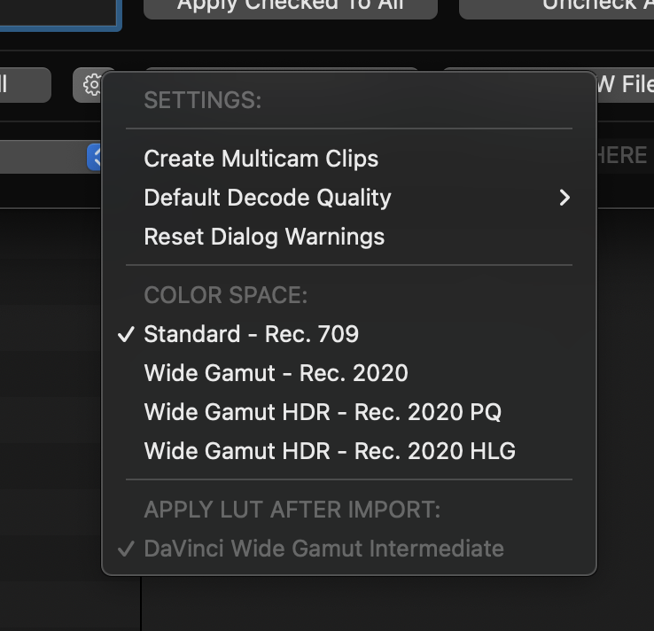
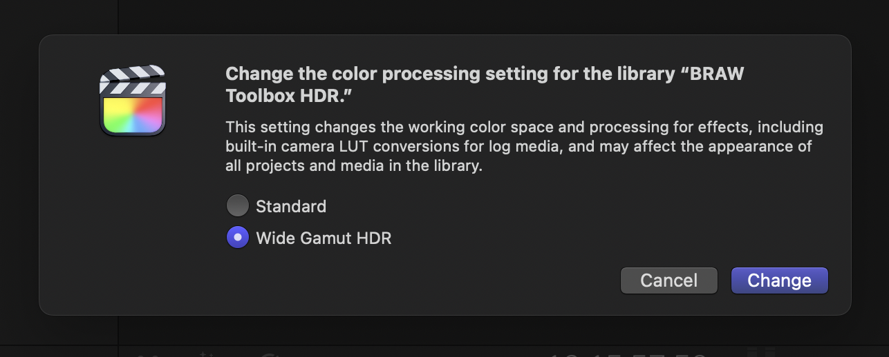
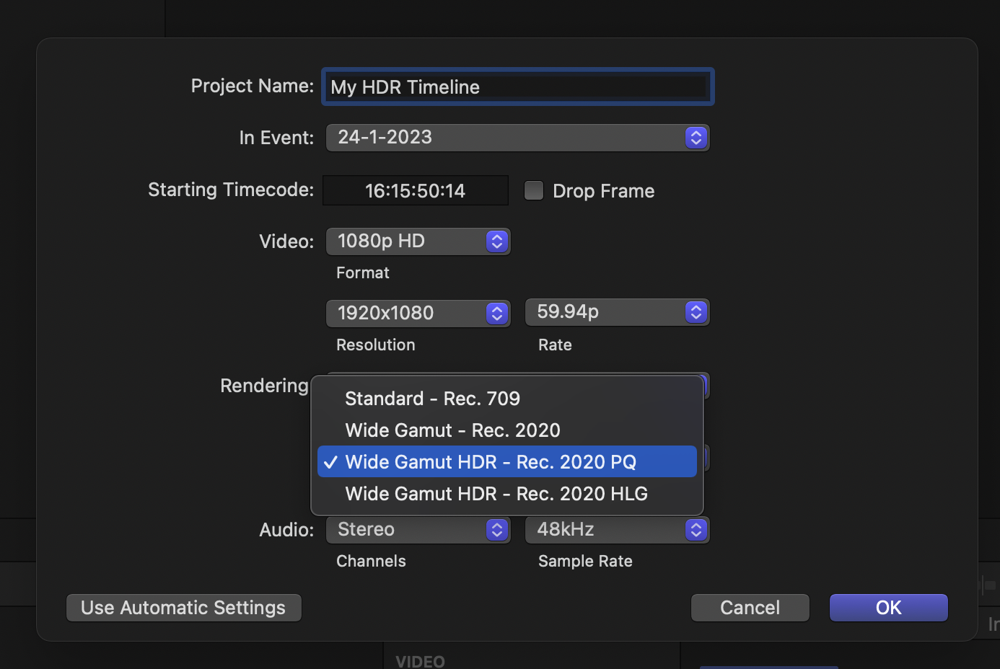
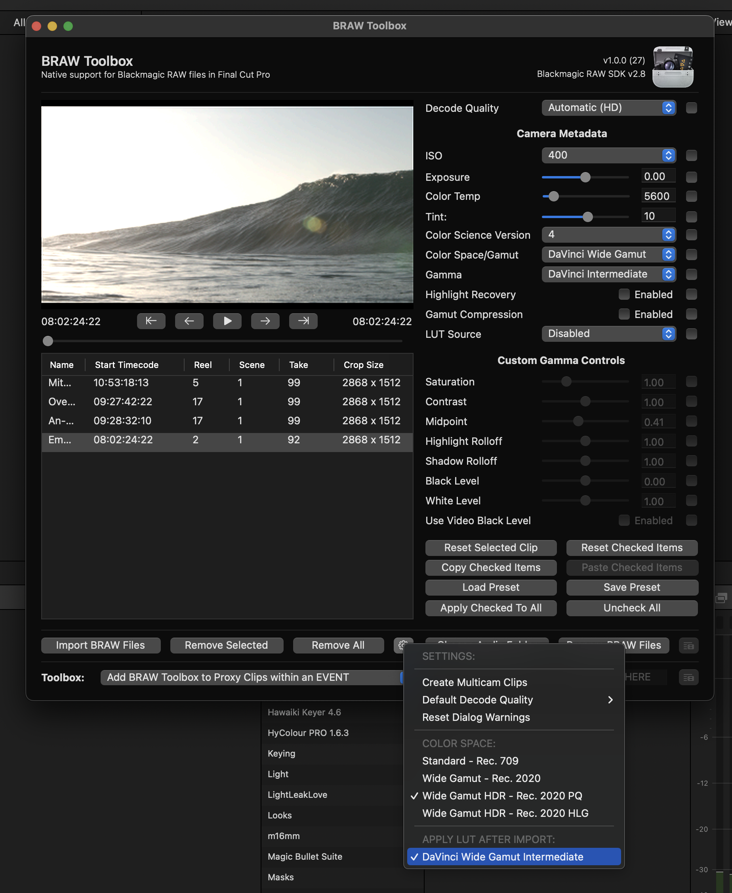
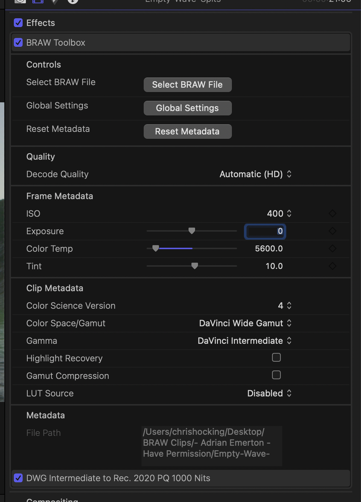

# HDR Workflow

Thanks to the amazing help of [Marc Bach](https://www.interfacelab.tv) and [Jamie Lejeune](https://www.cinedocs.com), we've worked closely to come up with some solid and reliable HDR Workflow for BRAW Toolbox.

In the BRAW Toolbox Workflow Extension, if you click on the **Settings** button (the gear icon, next to **Remove All**), you can select the Color Space:

Changing the Color Space will impact how the images look in the Workflow Extension player.

The Color Space you select, should match what you're using in Final Cut Pro.

When working in HDR within Final Cut Pro, your library should be set up to **Wide Gamut HDR** processing.

The Color Space in the Project/Timeline settings, should be set to either **Wide Gamut HDR - Rec. 2020 PQ** or **Wide Gamut HDR - Rec. 2020 HLG**.

Generally speaking, we recommend using **Wide Gamut HDR - Rec. 2020 PQ**.

Whilst you can technically use any **Color Space/Gamut** and **Gamma** setting in the BRAW Toolbox Workflow Extension, for best results, we recommend **DaVinci Wide Gamut** and **DaVinci Intermediate**.

When you choose **DaVinci Wide Gamut** and **DaVinci Intermediate**, and a **Wide Gamut HDR Rec. 2020 PQ** Color Space in BRAW Toolbox, there's an extra option in the **Settings** menu that allows you to select **DaVinci Wide Gamut Intermediate**.

When you select this option, you won't see anything different in the Workflow Extension Player. However, when you import the clips into Final Cut Pro, a special LUT is applied, which now means what you see in Final Cut Pro is exactly the same as what you'd see in DaVinci Resolve with the same settings.

This means you have fantastic grading control directly within Final Cut Pro, and the results will translate really nicely into DaVinci Resolve later down the line.

---

### Additional Resources

You can learn more about HDR Workflows in Final Cut Pro here:

- [HDR and Wide Color Gamut in Final Cut Pro White Paper](https://www.apple.com/final-cut-pro/docs/HDR_WideColor.pdf)
- [Intro to wide color gamut and HDR in Final Cut Pro](https://support.apple.com/en-au/guide/final-cut-pro/ver09be4f91f/mac)
- [Convert or adjust HDR clips in Final Cut Pro](https://support.apple.com/en-au/guide/final-cut-pro/verbf72f3e96/mac)