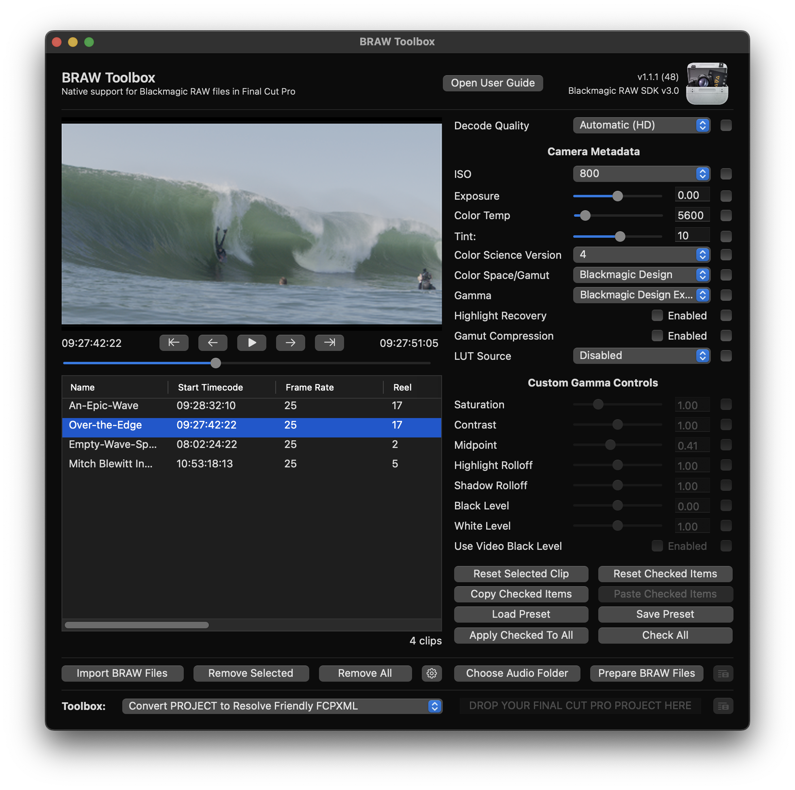
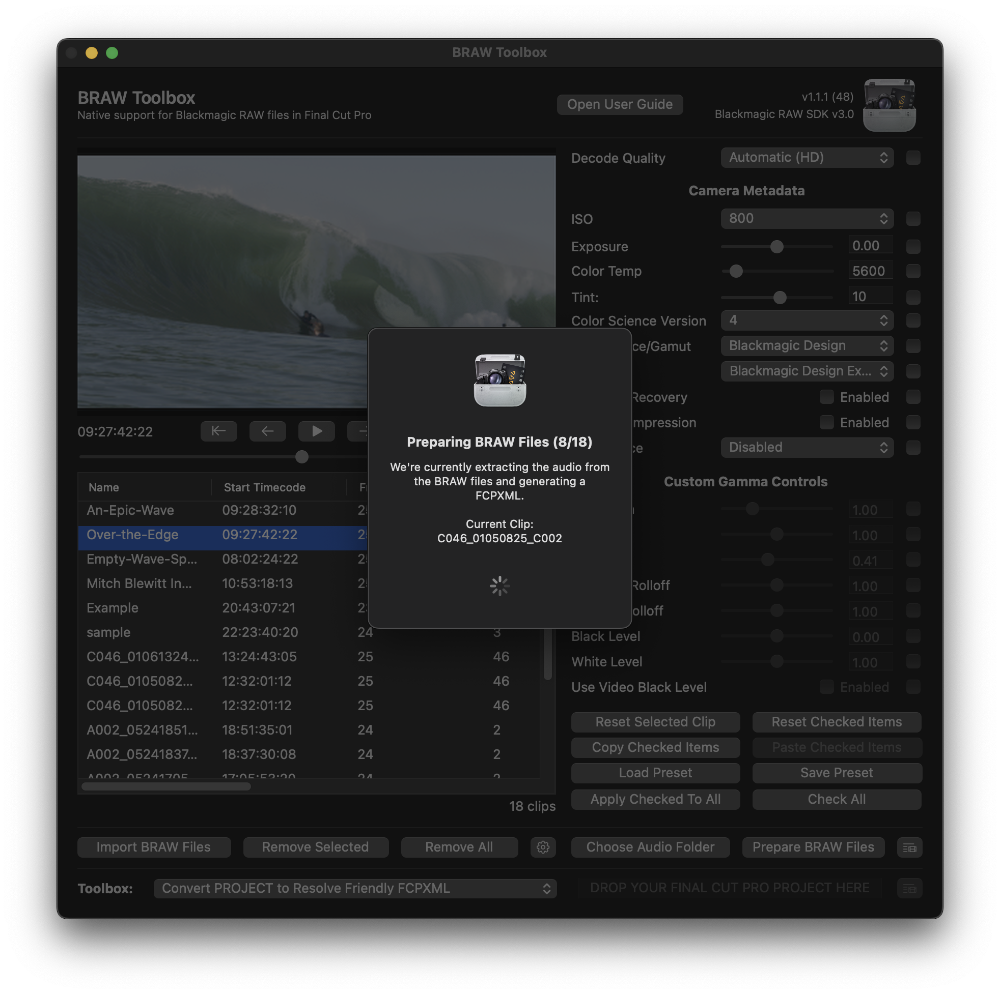
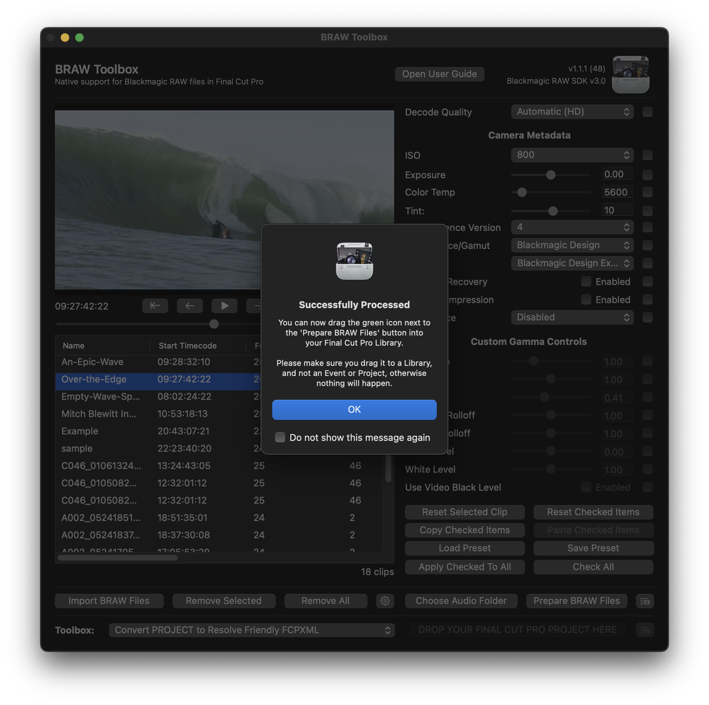
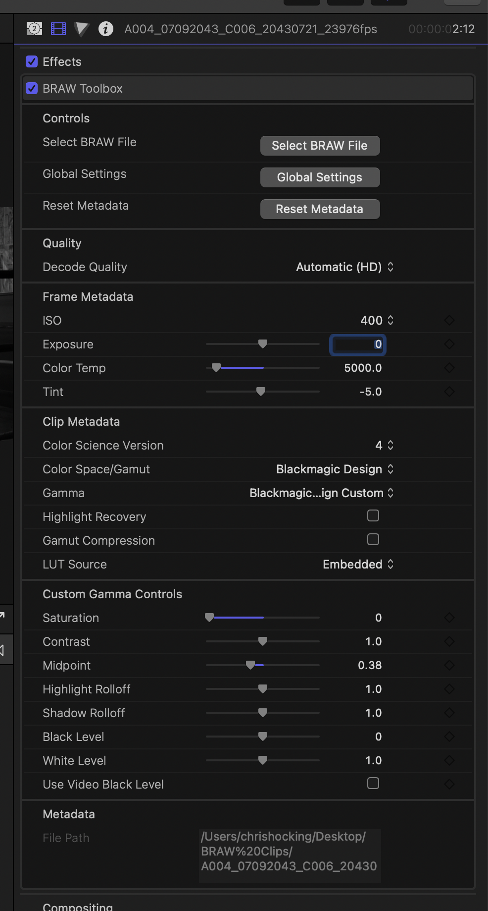

# How To Use

Once [installed](https://brawtoolbox.io/installation/) you can access BRAW Toolbox from the Workflow Extension button in Final Cut Pro:

You can also access it via the **Window > Extensions > BRAW Toolbox** menu item:

When you click either of those options it opens the BRAW Toolbox Workflow Extension:

To import some BRAW clips, click the **Import BRAW Files** button and select some BRAW clips.

> **TIP:** You can also drag-and-drop BRAW files from Finder to the File List.

You can now adjust all the metadata as required. There are tools for easily copy and pasting RAW parameters between clips, as well as saving Metadata Presets.

Whilst BRAW Toolbox can play back BRAW video files natively, to handle audio, it "extracts" the audio prior to sending to Final Cut Pro. You should press the **Choose Audio Folder** button to select the destination folder for these audio files.

Once you've tweaked any metadata settings, you can press the **Prepare BRAW Files** to get everything ready for Final Cut Pro.

> **NOTE:** If you haven't already pressed the **Choose Audio Folder**, it'll prompt you regardless the first time you click **Prepare BRAW Files**.

Whilst it's processing you'll see this:

Once it's processed, you'll get the below alert explaining what to do next.

> **TIP:** You can tick **Do not show this message again** to speed things up next time (and press **Reset Dialog Warning** via the Settings button if you want to bring this back).

Essentially, you need to drag this green button:

...to your Final Cut Pro **Library**.

> **IMPORTANT:** You need to drag to a **Library** - not an **Event** or a **Project**, otherwise nothing will happen.

This will create a new Keyword Collection with your BRAW clips:

You can now drag these Multicam Clips into a Project/Timeline and start editing, as you would normal video clips.

To modify the metadata of a BRAW clip, you can double click on one of the Multicam Clips, to open it in the **Angle Editor**:

You can then double click on the Synchronised Clip on the first angle:

You can now click on the Black Generator on the Primary Storyline, and access the BRAW Toolbox effect in the Effects section of the Inspector:

> **IMPORTANT:** Whilst you can modify the RAW parameters you shouldn't ever "cut" or change the timing of the Generator contained within the Synchronised Clip.

Click the **Show Parameters** button to show the parameters. You'll only have to do this once per clip, as Final Cut Pro will remember it's been opened.

You can now manipulate the RAW metadata as required.

Frame Metadata and Custom Gamma Controls are also key-frame-able.

> **TIP:** You can only access Custom Gamma Controls if you have the **Blackmagic Design Custom** gamma parameter selected.

You can now edit BRAW files like any other camera media in Final Cut Pro. Woohoo!

For a **slight performance increase**, we recommend granting Sandbox Access to the drive that contains your footage. You can learn more [here](https://brawtoolbox.io/collaboration/).