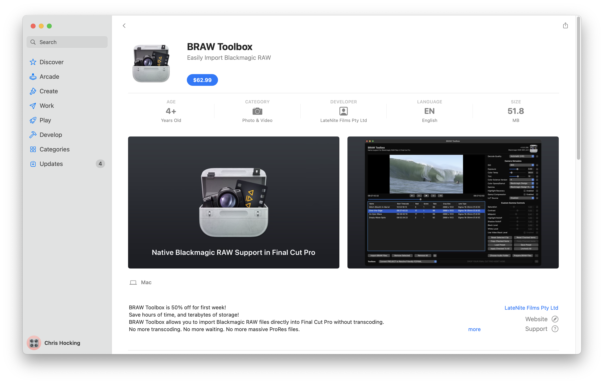

# Installation

### Video

    <iframe class="video" src="https://www.youtube-nocookie.com/embed/ybuRAGcTPuo" title="YouTube video player" frameborder="0" allow="accelerometer; autoplay; clipboard-write; encrypted-media; gyroscope; picture-in-picture; web-share" allowfullscreen></iframe>

---

### Instructions

You can download BRAW Toolbox from the Mac App Store.

> [:icon-desktop-download: **Click here to buy on the Mac App Store**](https://apps.apple.com/au/app/braw-toolbox/id6444061549?mt=12)

When you run it for the first time, you'll be presented with this:

If it's the first time installing the software, or if there's been an update, you'll be prompted to **Install Motion Templates**, **Install Metadata View** and **Install LUTs**.

> **IMPORTANT:** You should make sure that Final Cut Pro is not running at this point.

Once you click **Install Motion Templates**, you'll be prompted to grant permission to your Movies folder. This is due to macOS's sandboxing, and you'll only need to do this once. Click **OK**.

You then need to click **Grant Access**:

Once done, you'll be presented with a successful message:

After clicking **OK**, the **Install Motion Templates** button will now be disabled, and will instead say **Motion Templates Installed**.

You should now click the **Install Metadata View** button, and you'll be prompted to grant permission to your ProApps folder. Click **OK** again:

You need to click the **Grant Access** button:

Once done, you'll be presented with a successful message:

The **Install Metadata View** button will now be disabled, and will say **Metadata View Installed**.

You now need to click the **Install LUTs** button. LUTs are stored in the same root folder as the Metadata View's, so you don't need to grant it permission again.

After clicking the button you'll be presented with a successful message:

After clicking **OK**, you can now click **Launch Final Cut Pro**, which will close the BRAW Toolbox application and Launch Final Cut Pro.

> **IMPORTANT:** You should run the BRAW Toolbox application again after each update, to make sure you're using the latest Motion Templates, Metadata View, and LUTs.

You can learn how to use BRAW Toolbox [here](https://brawtoolbox.io/how-to-use/)