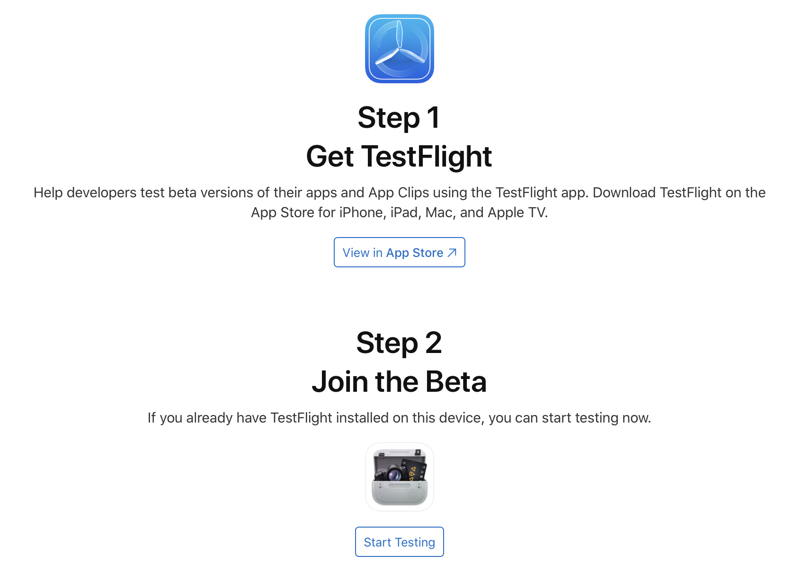
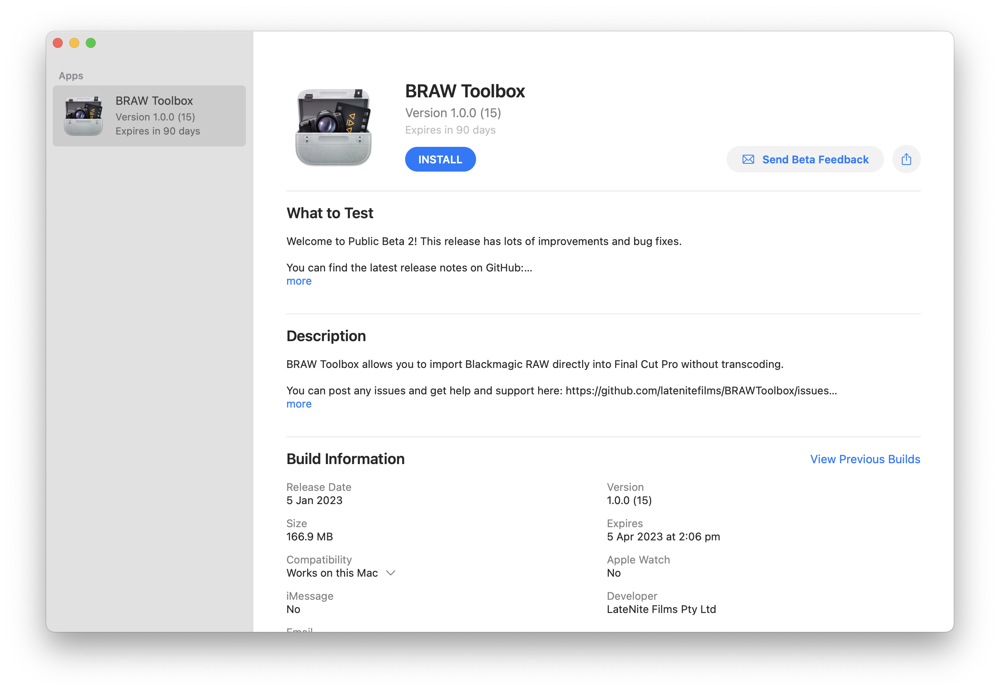
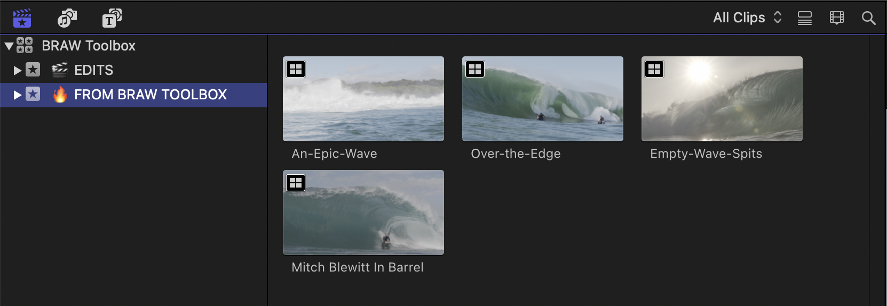
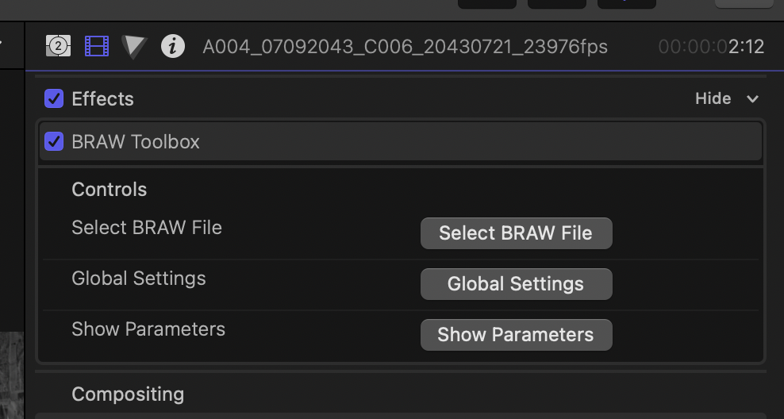

# Installation

You first need to join the TestFlight Beta by clicking on [this invite](https://testflight.apple.com/join/dbWjWl8e).

Once you've installed TestFlight and clicked on the above link, you will see BRAW Toolbox within the TestFlight application.

After you click the **INSTALL** button, the main BRAW Toolbox application will run.

If it's the first time installing the software, or if there's been an update, you'll be prompted to **Install Motion Templates**, **Install Metadata View** and **Install LUTs**.

> **IMPORTANT:** You should make sure that Final Cut Pro is not running at this point.

Once you click **Install Motion Templates**, you'll be prompted to grant permission to your Movies folder. This is due to macOS's sandboxing, and you'll only need to do this once. Click **OK**.

You then need to click **Grant Access**:

Once done, you'll be presented with a successful message:

After clicking **OK**, the **Install Motion Templates** button will now be disabled, and will instead say **Motion Templates Installed**.

You should now click the **Install Metadata View** button, and you'll be prompted to grant permission to your ProApps folder. Click **OK** again:

You need to click the **Grant Access** button:

Once done, you'll be presented with a successful message:

The **Install Metadata View** button will now be disabled, and will say **Metadata View Installed**.

You now need to click the **Install LUTs** button. LUTs are stored in the same root folder as the Metadata View's, so you don't need to grant it permission again.

After clicking the button you'll be presented with a successful message:

After clicking **OK**, you can now click **Launch Final Cut Pro**, which will close the BRAW Toolbox application and Launch Final Cut Pro.

> **IMPORTANT:** You should run the BRAW Toolbox application again after each update, to make sure you're using the latest Motion Templates, Metadata View, and LUTs.

Once Final Cut Pro is launched you can access BRAW Toolbox via the **Workflow Extension** button:

You can also access it via the **Window > Extensions > BRAW Toolbox** menu item:

When you click either of those options it opens the BRAW Toolbox Workflow Extension:

To import some BRAW clips, click the **Import BRAW Files** button and select some BRAW clips.

> **TIP:** You can also drag-and-drop BRAW files from Finder to the File List.

You can now adjust all the metadata as required. There are tools for easily copy and pasting RAW parameters between clips, as well as saving Metadata Presets.

Whilst BRAW Toolbox can play back BRAW video files natively, to handle audio, it "extracts" the audio prior to sending to Final Cut Pro. You should press the **Choose Audio Folder** button to select the destination folder for these audio files.

Once you've tweaked any metadata settings, you can press the **Prepare BRAW Files** to get everything ready for Final Cut Pro.

> **NOTE:** If you haven't already pressed the **Choose Audio Folder**, it'll prompt you regardless the first time you click **Prepare BRAW Files**.

Whilst it's processing you'll see this:

Once it's processed, you'll get the below alert explaining what to do next.

> **TIP:** You can tick **Do not show this message again** to speed things up next time (and press **Reset Dialog Warning** via the Settings button if you want to bring this back).

Essentially, you need to drag this green button:

...to your Final Cut Pro **Library**.

> **IMPORTANT:** You need to drag to a **Library** - not an **Event** or a **Project**, otherwise nothing will happen.

This will create a new Keyword Collection with your BRAW clips:

To modify the metadata of a BRAW clip, you can double click on one of the synchronised clips, click on the black video clip, then access the BRAW Toolbox effect in the Effects section of the Inspector:

Click the **Show Parameters** button to show the parameters. You'll only have to do this once per clip, as Final Cut Pro will remember it's been opened.

Frame Metadata and Custom Gamma Controls are key-frame-able.

> **TIP:** You can only access Custom Gamma Controls if you have the **Blackmagic Design Custom** gamma parameter selected.

You can now edit BRAW files like any other camera media in Final Cut Pro. Woohoo!