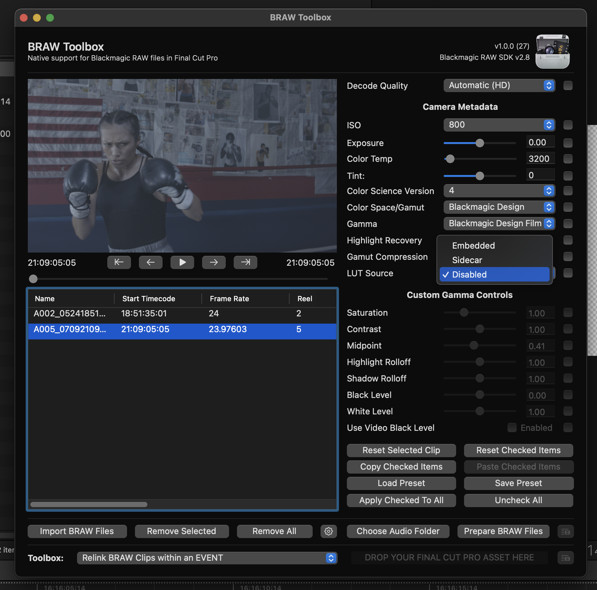
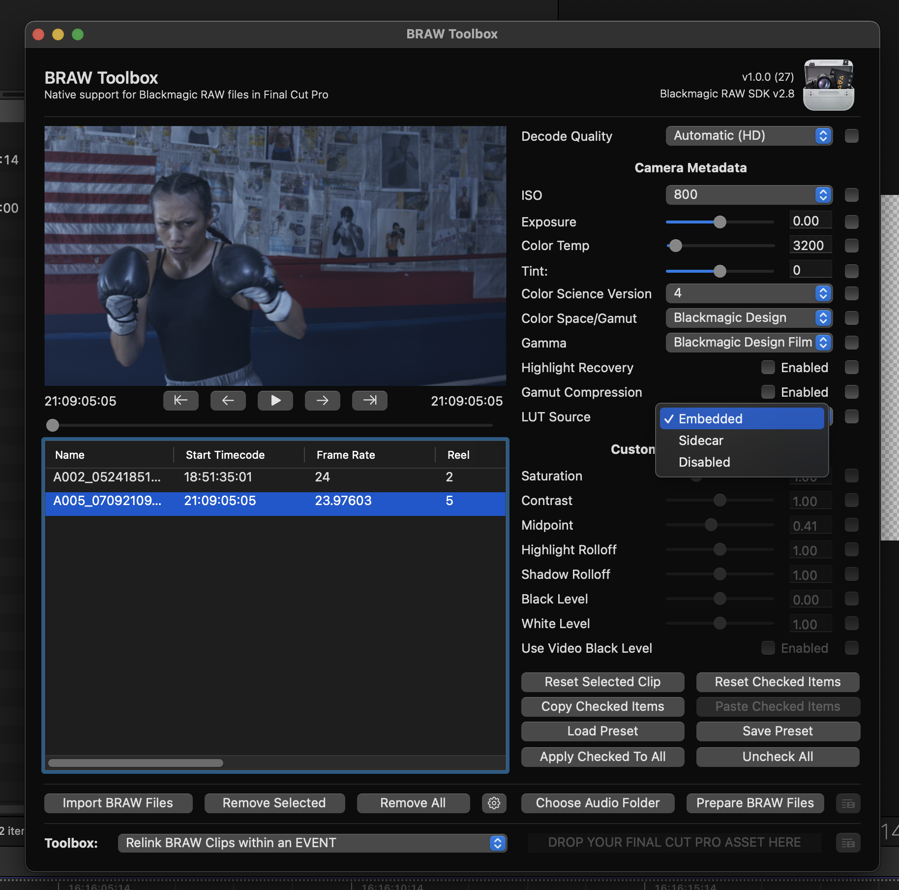
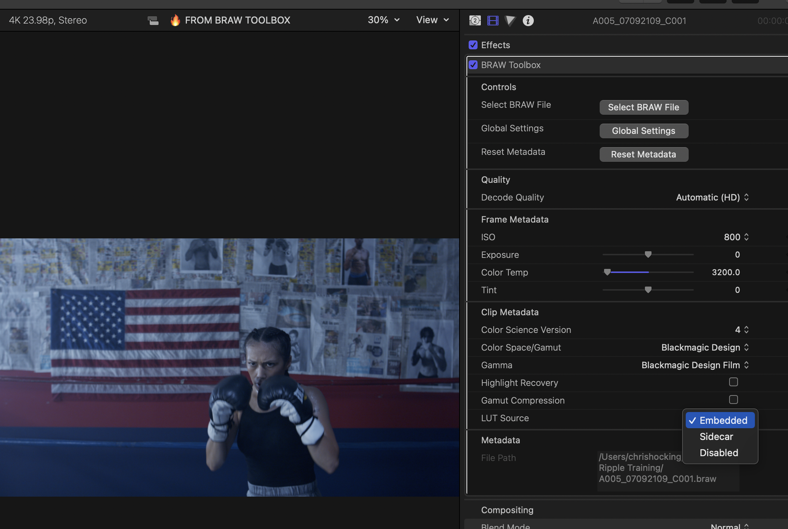

# LUTs

In the BRAW Toolbox Workflow Extension, and Final Cut Pro Inspector you are able to set the **LUT Source** for individual clips.

There are currently three options:

- **Disabled:** No LUT will be used.
- **Sidecar:** If a sidecar file exists and includes a LUT, that LUT will be used.
- **Embedded:** If a LUT was selected during filming, and is included in the BRAW file, it will be used.

If you didn't select a LUT during filming, the easiest way to add a new LUT is to just use the **Custom LUT** effect in Final Cut Pro.

You can simply apply that LUT to the Synchronised Clip or Multicam Clip of your BRAW Toolbox clip.

BRAW Toolbox clips don't have the ability to set a traditional **Camera LUT**, because it's not really necessary, as you can change the **Color Space/Gamut** and **Gamma** as required in both the Workflow Extension and Final Cut Pro Inspector.

