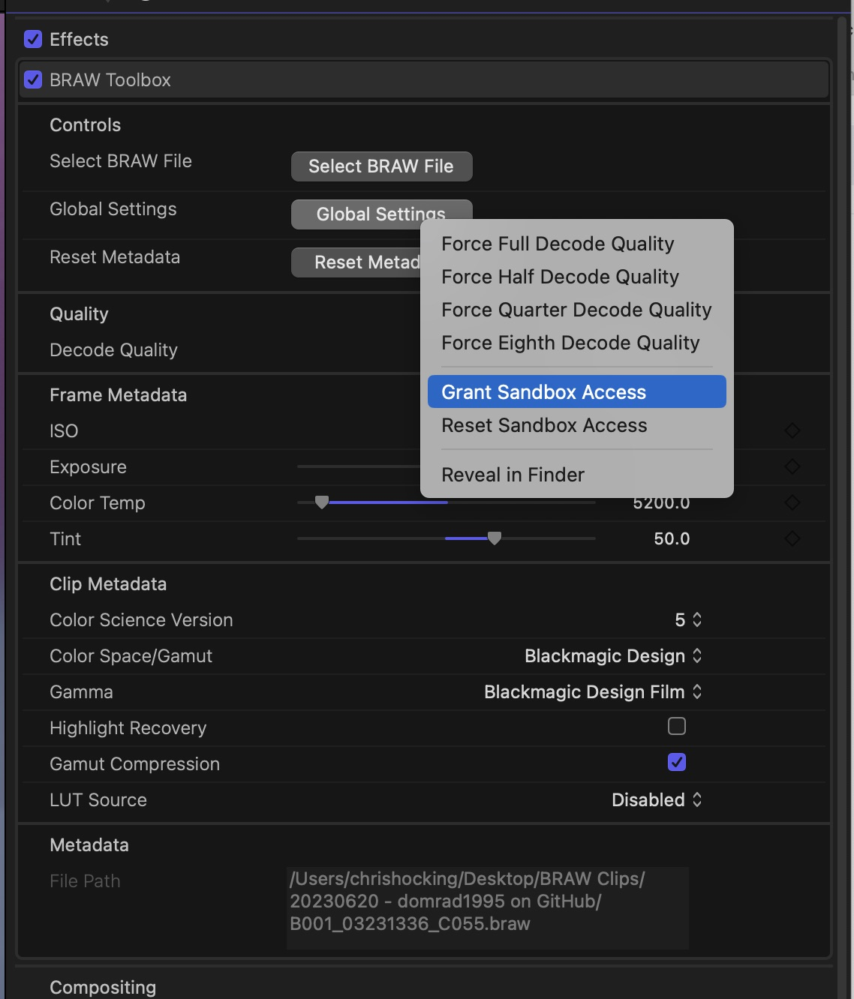
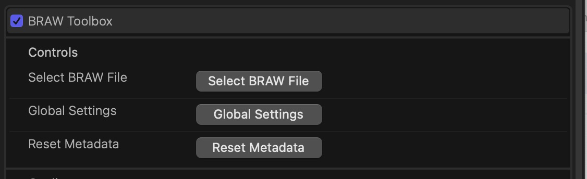

# Relinking Media

In terms of visuals, a BRAW Toolbox clip is essentially just an **Effect** (the BRAW Toolbox effect) applied to a **Generator** (just a generic Custom Solid), contained within a **Synchronised Clip**, contained within a **Multicam Clip**.

In terms of sound, when you import a BRAW clip into Final Cut Pro via the BRAW Toolbox Workflow Extension, we "extract" the audio from the BRAW file and write it to disk (at the location you decide) as a normal WAV file.

This means that whilst you can use the built-in **Final Cut Pro File > Relink Files > Original Media...** menubar item for relinking the audio - you can't use the built-in tool for relinking the BRAW files, because there is no media files in Final Cut Pro - just a effect and a generator.

The BRAW Toolbox Effect stores within it two things:

- **File Path:** A plain-text path to the BRAW file
- **Bookmark Data:** A device specific security-scope bookmark to the BRAW file (basically a "link" to the file that works in a sandbox)

You can see this information if you export a FCPXML of your timeline, for example:

```xml #2-3
<filter-video ref="r7" name="BRAW Toolbox">
    <param name="File Path" key="9999/10015/10018/3/10028/100/101" value="/Volumes/My External Hard Drive/My BRAW File.braw"/>
    <param name="Bookmark Data" key="9999/10015/10018/3/10028/100/102" value="Ym9va3ADAAAAAAQQMAAAANzxm2p1S8BPQJILNuVvklpZSKYu1WUDhRe6gWEpUQQBSAIAAAQAAAADAwAAABgAKAUAAAABAQAAVXNlcnMAAAAMAAAAAQEAAGNocmlzaG9ja2luZwcAAAABAQAARGVza3RvcAAKAAAAAQEAAEJSQVcgQ2xpcHMAAB8AAAABAQAAMjAyMzA2MjAgLSBkb21yYWQxOTk1IG9uIEdpdEh1YgAXAAAAAQEAAEIwMDFfMDMyMzEzMzZfQzA1NS5icmF3ABgAAAABBgAAEAAAACAAAAA0AAAARAAAAFgAAACAAAAACAAAAAQDAACEXAAAAAAAAAgAAAAEAwAAYKgDAAAAAAAIAAAABAMAAGWoAwAAAAAACAAAAAQDAADo914CAAAAAAgAAAAEAwAA7h87BQAAAAAIAAAABAMAAAQgOwUAAAAAGAAAAAEGAADAAAAA0AAAAOAAAADwAAAAAAEAABABAAAIAAAAAAQAAEHFIQg4gAAAGAAAAAECAAABAAAAAAAAAA8AAAAAAAAAAAAAAAAAAAAAAAAAAQUAAAQAAAADAwAABgAAAAQAAAADAwAABAAAAAgAAAAEAwAABAAAAAAAAAAEAAAAAwMAAPUBAAAIAAAAAQkAAGZpbGU6Ly8vDAAAAAEBAABNYWNpbnRvc2ggSEQIAAAABAMAAACA1E5GBwAACAAAAAAEAABBxYSbM4AAACQAAAABAQAAQThCMUEzNDktODg3Mi00QUJFLThDMTQtMzUyQzJBNENFRUQ3GAAAAAECAACBAAAAAQAAAO8TAAABAAAAAAAAAAAAAAABAAAAAQEAAC8AAADwAAAA/v///wEAAAAAAAAAEwAAAAQQAACgAAAAAAAAAAUQAAAgAQAAAAAAABAQAABQAQAAAAAAAEAQAABAAQAAAAAAAFQQAAB4AQAAAAAAAFUQAACEAQAAAAAAAFYQAABwAQAAAAAAAAIgAAA8AgAAAAAAAAUgAACsAQAAAAAAABAgAAC8AQAAAAAAABEgAADwAQAAAAAAABIgAADQAQAAAAAAABMgAADgAQAAAAAAACAgAAAcAgAAAAAAADAgAABwAQAAAAAAAAHAAACQAQAAAAAAABHAAAAgAAAAAAAAABLAAACgAQAAAAAAABDQAAAEAAAAAAAAAA=="/>
    <param name="Decode Quality" key="9999/10015/10018/3/10028/30/31" value="0 (Automatic (HD))"/>
    <param name="ISO" key="9999/10015/10018/3/10028/50/51" value="6 (400)"/>
    <param name="Exposure" key="9999/10015/10018/3/10028/50/52" value="0"/>
    <param name="Color Temp" key="9999/10015/10018/3/10028/50/53" value="5200"/>
    <param name="Tint" key="9999/10015/10018/3/10028/50/54" value="50"/>
    <param name="Color Science Version" key="9999/10015/10018/3/10028/70/71" value="1 (5)"/>
    <param name="Color Space/Gamut" key="9999/10015/10018/3/10028/70/72" value="0 (Blackmagic Design)"/>
    <param name="Gamma" key="9999/10015/10018/3/10028/70/73" value="0 (Blackmagic Design Film)"/>
    <param name="Highlight Recovery" key="9999/10015/10018/3/10028/70/74" value="0"/>
    <param name="Gamut Compression" key="9999/10015/10018/3/10028/70/75" value="1"/>
    <param name="LUT Source" key="9999/10015/10018/3/10028/70/76" value="2 (Disabled)"/>
    <param name="Saturation" key="9999/10015/10018/3/10028/90/91" value="1"/>
    <param name="Contrast" key="9999/10015/10018/3/10028/90/92" value="1"/>
    <param name="Midpoint" key="9999/10015/10018/3/10028/90/93" value="0.5"/>
    <param name="Highlight Rolloff" key="9999/10015/10018/3/10028/90/94" value="1"/>
    <param name="Shadow Rolloff" key="9999/10015/10018/3/10028/90/95" value="1"/>
    <param name="Black Level" key="9999/10015/10018/3/10028/90/96" value="0"/>
    <param name="White Level" key="9999/10015/10018/3/10028/90/97" value="1"/>
    <param name="Use Video Black Level" key="9999/10015/10018/3/10028/90/98" value="0"/>
    <param name="disableDRT" key="3733" value="1"/>
</filter-video>
```

BRAW Toolbox will always try to read the plain text **File Path** first, and if that fails, it'll try and resolve the **Bookmark Data**.

This is why we recommend granting BRAW Toolbox sandbox access to your drive, because then it can just read the file path and open the BRAW file directly, because it already has sandbox access to it.

You can grant sandbox access to an entire drive (or network share) by opening any BRAW Toolbox effect, then clicking on **Global Settings**, then **Grant Sandbox Access**.



You can also **Reset Sandbox Access** if needed at any stage, which removes sandbox permission to any locations you've previously granted access for. You will need to restart Final Cut Pro for this to take affect.

What this means is that the only way to **relink** a BRAW Toolbox clip is to update the **File Path** and/or the **Bookmark Data** for each BRAW Toolbox clip in your library.

Technically, you could do this manually by exporting a FCPXML, opening it in a text editor, adjusting each **File Path**, then reimporting into Final Cut Pro. As long as BRAW Toolbox has been granted sandbox access to the location of your BRAW files, it'll just work.

You can also manually relink BRAW files one-by-one by pressing the **Select BRAW File** button in the BRAW Toolbox Effect:



This will only update the **File Path** & **Bookmark Data** - it won't change any of your existing RAW parameters or keyframes.

---

## Common Mistake with Renders

One common support request we get is from people who have moved media at the Finder level, but didn't notice because they have **Background render** enabled in Final Cut Pro, so all their BRAW clips are already rendered, and they don't see the usual "offline clip" error message.

This is because BRAW Toolbox is just an effect - when you render in Final Cut Pro, that effect is essentially "baked in".

Because of this, it takes them a while to notice something is wrong, then they blame BRAW Toolbox, forgetting that they actually moved the files to a different drive or folder.

Once they move the files back to their original location - everything goes back perfectly to normal instantly.

However if they want to keep the new file location, then they can either manually relink as explained above, or use our handy Toolbox...

---

## Relink BRAW Clips within an LIBRARY / EVENT / PROJECT

As explained above, whilst it's possible to manually re-link things, you don't really want to do that, so we've created an easier way to relink things via the Workflow Extension.

This Toolbox allows you to relink any BRAW Toolbox clips within a **Library**, **Event** or **Project**.

If, for example, you have all your BRAW Toolbox clips within the default **🔥 FROM BRAW TOOLBOX** Event, you could just relink that event.

If you've moved BRAW clips to another folder/machine, or you've reinstalled macOS, you can use this Toolbox to easily update/fix the file paths and bookmarks.

This is how an offline clip will look in Final Cut Pro:


To use this Toolbox, simply drag a **Library**, **Event** or **Project** from the Final Cut Pro Browser into the Toolbox at the bottom of the BRAW Toolbox Workflow Extension.


You'll be presented with a Relink BRAW Files panel like this:


- If the status of a clip is **red**, it means the path to the BRAW file is invalid, and you'll need to manually correct it.
- If the status of a clip is **orange**, it means that the security-scope bookmark is still working, but it's stale and needs updating.

You can correct it manually in the path list, or you can use the Find & Replace functionality.

For example, if you've moved your BRAW files to a new external drive, you can right-click on the folder where they are in **Finder**, hold down **OPTION**, then click **Copy as Pathname**.

This will copy the path of the folder to the pasteboard. You can then press the **Paste** button next to the **Replace** textbox to paste it there.


You can now press the **Process Find & Replace** button to apply this Find & Replace changes to everything in the above list.

Once complete you'll be presented with a success message:


Everything will still be read, as you've **only updated the paths** - you haven't relinked anything yet.

When you press the **Refresh & Request Permissions** button, you'll be presented with this:


You'll then be able to Grant Sandbox Access to any drives/folders/network shares that contain your BRAW clips that BRAW Toolbox currently doesn't have access to. Click **Grant Access** for each one.

Once complete, all your clips should now be green:


You can now press the **Send FCPXML to Final Cut Pro** button.

You'll be asked to select a **Library** to import to, and then whether or not you want to **Keep Both** or **Replace** the files:


Generally speaking, as you're relinking you want to **Replace**, however FCPXML isn't lossless or perfect (i.e. currently FCPXML [doesn't contain all Title parameters](https://github.com/CommandPost/FCPCafe/issues/3)), so you should only select **Replace** if you only dragged in BRAW Toolbox Clips (i.e. the default **🔥 FROM BRAW TOOLBOX** Event) - not projects/timelines.

**NOTE:** For long time BRAW Toolbox users, this new **Send FCPXML to Final Cut Pro** button works differently than the way the previous **Relink BRAW Clips within an EVENT** Toolbox - as there's no dragging and dropping involved.

Pressing this button will trigger the import process within Final Cut Pro - no drag and drop required.