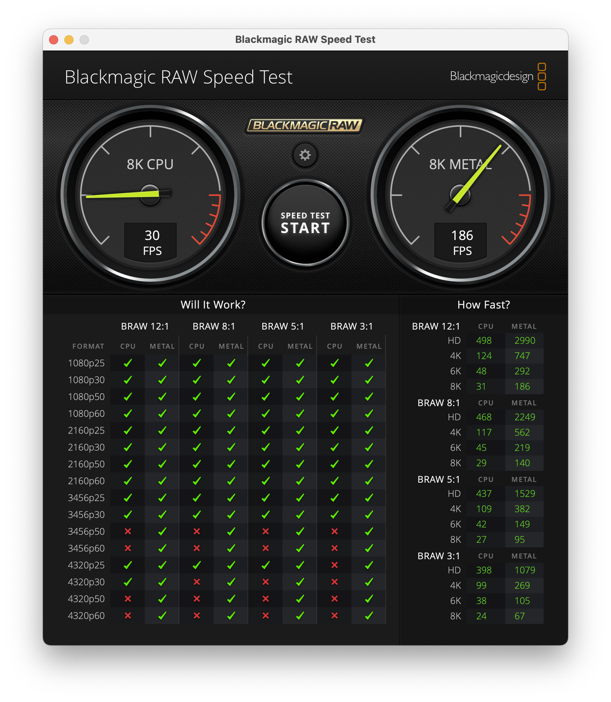

# System Requirements

BRAW Toolbox requires **Final Cut Pro 10.6.5** or later. It works great on the latest **Final Cut Pro 10.6.10**.

It works best on the latest Apple Silicon Mac's, however Intel is also supported.

Unfortunately, currently BRAW Toolbox won't work on Final Cut Pro for iPad, however if Apple does add third party FxPlug4 support, we'll definitely look into this!

You can find Final Cut Pro's system requirements [here](https://www.apple.com/au/final-cut-pro/specs/).

Before you purchase, you should make sure that your system has a fast enough GPU and hard drive to play back BRAW files.

You can use Blackmagic's free [Blackmagic RAW Speed Test](https://apps.apple.com/us/app/blackmagic-raw-speed-test/id1466185689?mt=12) and [Blackmagic Disk Speed Test](https://apps.apple.com/au/app/blackmagic-disk-speed-test/id425264550?mt=12) tools to ensure your system is fast enough for the footage you want to work with.

You can also use Blackmagic's free [Blackmagic RAW Player](https://apps.apple.com/us/app/blackmagic-raw-player/id1435415804?mt=12) to test playing back BRAW files on your system.

