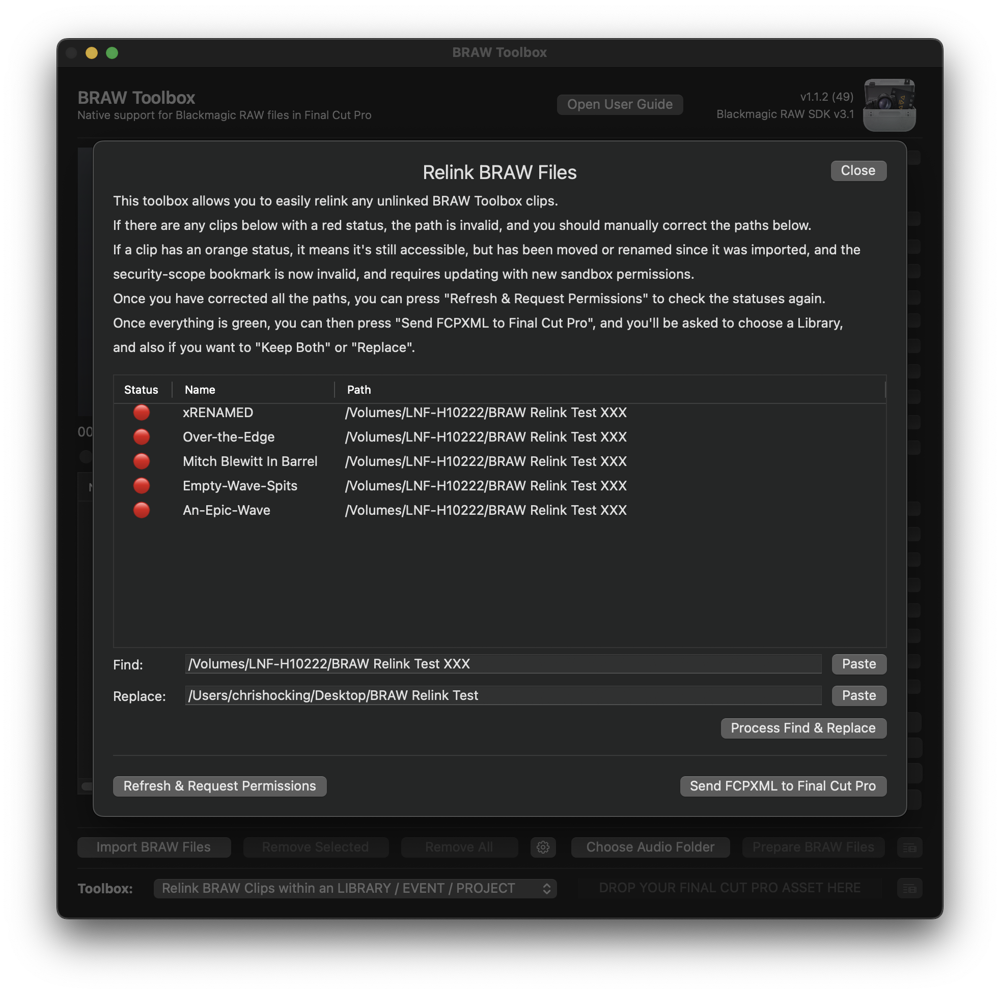

# Toolbox

The BRAW Toolbox Workflow Extension contains a collection of additional **Toolbox** features to help get things in and out of Final Cut Pro.

---

### Repair Synchronized Clips (prior to v1.1.3)

Thanks to the help and support of the awesome Final Cut Pro team, we finally have a workaround to the Synchronised Clips bug.

Previously, Synchronised Clips could cause random glitches during playback, and produce unexpected results in some, but not all, cases.

As a result, in BRAW Toolbox v1.1.1 we made **Create Multicam Clips** the default option as a workaround to this issue.

We now know this was actually due to the fact that we're applying the BRAW Toolbox effect to a **Custom** Solids Generator.

Whilst Final Cut Pro worked correctly when scrubbing and skimming a clip, during playback, because the Custom generator normally doesn't change its output (i.e. it's always a static colour), Final Cut Pro was using a cached frame, rather than rendering a new frame, which caused the glitches.

Essentially, it's very unusual for an Effect to change the output of a Generator, so we were getting unpredictable results.

We now workaround this issue by simply applying keyframes to the Custom Solid, so that Final Cut Pro always renders the frames - simple, but effective.

To fix Synchronized Clips created in earlier versions of BRAW Toolbox, we've added a **Repair Synchronized Clips (prior to v1.1.3)** Toolbox, which will add keyframes to all your Generators within the BRAW Toolbox Clip.

HUGE thank you to Tangier Clarke for supplying a reproducible library to help us solve this annoying bug. We'll leave **Create Multicam Clips** on by default, however you will no longer get a warning message when you toggle this preference.

To use this Toolbox simply drag a Library, Event or Project into the Toolbox.

You'll be asked to select a library to import to, and then whether or not you want to **Keep Both** or **Replace** the files:

Generally speaking, as you're repairing clips you want to **Replace**, however FCPXML isn't lossless or perfect, so you should only select **Replace** if you only dragged in BRAW Toolbox Clips - not projects/timelines.

Pressing this button will trigger the import process within Final Cut Pro - no drag and drop required.

---

### Relink BRAW Clips within an LIBRARY / EVENT / PROJECT

This Toolbox allows you to relink any BRAW Toolbox clips within a **Library**, **Event** or **Project**.

If, for example, you have all your BRAW Toolbox clips within the default **🔥 FROM BRAW TOOLBOX** Event, you could just relink that event.

If you've moved BRAW clips to another folder/machine, or you've reinstalled macOS, you can use this Toolbox to easily update/fix the file paths and bookmarks.

This is how an offline clip will look in Final Cut Pro:

To use this Toolbox, simply drag a **Library**, **Event** or **Project** from the Final Cut Pro Browser into the Toolbox at the bottom of the BRAW Toolbox Workflow Extension.

You'll be presented with a Relink BRAW Files panel like this:

- If the status of a clip is **red**, it means the path to the BRAW file is invalid, and you'll need to manually correct it.
- If the status of a clip is **orange**, it means that the security-scope bookmark is still working, but it's stale and needs updating.

You can correct it manually in the path list, or you can use the Find & Replace functionality.

For example, if you've moved your BRAW files to a new external drive, you can right-click on the folder where they are in **Finder**, hold down **OPTION**, then click **Copy as Pathname**.

This will copy the path of the folder to the pasteboard. You can then press the **Paste** button next to the **Replace** textbox to paste it there.

You can now press the **Process Find & Replace** button to apply this Find & Replace changes to everything in the above list.

Once complete you'll be presented with a success message:

Everything will still be read, as you've **only updated the paths** - you haven't relinked anything yet.

When you press the **Refresh & Request Permissions** button, you'll be presented with this:

You'll then be able to Grant Sandbox Access to any drives/folders/network shares that contain your BRAW clips that BRAW Toolbox currently doesn't have access to. Click **Grant Access** for each one.

Once complete, all your clips should now be green:

You can now press the **Send FCPXML to Final Cut Pro** button.

You'll be asked to select a **Library** to import to, and then whether or not you want to **Keep Both** or **Replace** the files:

Generally speaking, as you're relinking you want to **Replace**, however FCPXML isn't lossless or perfect (i.e. currently FCPXML [doesn't contain all Title parameters](https://github.com/CommandPost/FCPCafe/issues/3)), so you should only select **Replace** if you only dragged in BRAW Toolbox Clips (i.e. the default **🔥 FROM BRAW TOOLBOX** Event) - not projects/timelines.

**NOTE:** For long time BRAW Toolbox users, this new **Send FCPXML to Final Cut Pro** button works differently than the way the previous **Relink BRAW Clips within an EVENT** Toolbox - as there's no dragging and dropping involved.

Pressing this button will trigger the import process within Final Cut Pro - no drag and drop required.

---

### Convert PROJECT to Resolve Friendly FCPXML

To convert a project/timeline into something you can easily import into DaVinci Resolve (or other colour grading apps), you can drag your project from the Final Cut Pro Browser to the Toolbox at the bottom of the Workflow Extension.

This will create a new FCPXML, where it converts the BRAW Toolbox clips into normal BRAW clips.

---

### Convert PROJECT to Resolve Friendly FCPXML (via CP)

This works the same as above, but instead of prompting you for a filename, it'll send the processed FCPXML directly to CommandPost for processing.

The main use-case of this feature is if you're using both BRAW files and Sony MP4s with incorrect timecode, as you can send straight to CommandPost's Sony Timecode Toolbox.

For this to work, you need to make sure you select **Send FCPXML to Sony Timecode Toolbox** in the **Drag & Drop File Action** dropdown in the **General** section of CommandPost's Preferences.

---

### Convert BRAW clips to MOV's within an EVENT

!!!danger
This Toolbox currently only works if you have BRAW files and MOV files in the same folder next to each other.

We will improve this in a future update.
!!!

This Toolbox allows you to convert BRAW Toolbox clips to MOV's within an Event.

Simply drag an event to the Toolbox drop zone. You'll be presented with a success message.

You then drag the green icon back into your Final Cut Pro Library.

---

### Add BRAW Toolbox to Proxy Clips within an EVENT

!!!danger
This Toolbox currently has some issue which will be addressed in a future update.

You can learn more [here](https://github.com/latenitefilms/BRAWToolbox/issues/124#issuecomment-1532247236).
!!!

This Toolbox will add the BRAW Toolbox effect to any clips in the event that have an accompanying BRAW file - for example, if you created proxy clips with [Color Finale Transcoder](https://colorfinale.com/transcoder) or [EditReady](https://hedge.video/editready).

It only converts clips in cases where a BRAW file is contained in the same folder as a MOV with the same filename.

Simply drag an event to the Toolbox drop zone. You'll be presented with a success message.

You then drag the green icon back into your Final Cut Pro Library.

