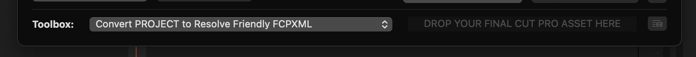

# Toolbox

The BRAW Toolbox Workflow Extension contains a collection of additional **Toolbox** features to help get things in and out of Final Cut Pro.

---

### Convert PROJECT to Resolve Friendly FCPXML

To convert a project/timeline into something you can easily import into DaVinci Resolve (or other colour grading apps), you can drag your project from the Final Cut Pro Browser to the Toolbox at the bottom of the Workflow Extension.

This will create a new FCPXML, where it converts the BRAW Toolbox clips into normal BRAW clips.

---

### Convert PROJECT to Resolve Friendly FCPXML (via CP)

This works the same as above, but instead of prompting you for a filename, it'll send the processed FCPXML directly to CommandPost for processing.

The main use-case of this feature is if you're using both BRAW files and Sony MP4s with incorrect timecode, as you can send straight to CommandPost's Sony Timecode Toolbox.

For this to work, you need to make sure you select **Send FCPXML to Sony Timecode Toolbox** in the **Drag & Drop File Action** dropdown in the **General** section of CommandPost's Preferences.

---

### Relink BRAW Clips within an EVENT

This Toolbox allows you to relink any BRAW Toolbox clips within an event.

For example, if you've moved BRAW clips to another folder/machine, you can use this Toolbox to easily adjust the file paths.

You can manually modify the path of the files (and also do a global **Find & Replace** of all paths).

Click the **Refresh & Request Permissions** buttons after you have updated the paths in the list.

You'll be prompted to Grant Permission to any folders/drives that BRAW Toolbox can't currently access.

Once all the items show a green status icon, you can then press **Relink BRAW Files**, and drag the green icon to your Final Cut Pro library.

It will create a new Event with the relinked clips.

---

### Convert BRAW clips to MOV's within an EVENT

This Toolbox allows you to convert BRAW Toolbox clips to MOV's within an Event.

Simply drag an event to the Toolbox drop zone. You'll be presented with a success message.

You then drag the green icon back into your Final Cut Pro Library.

---

### Add BRAW Toolbox to Proxy Clips within an EVENT

This Toolbox will add the BRAW Toolbox effect to any clips in the event that have an accompanying BRAW file - for example, if you created proxy clips with [Color Finale Transcoder](https://colorfinale.com/transcoder) or [EditReady](https://hedge.video/editready).

It only converts clips in cases where a BRAW file is contained in the same folder as a MOV with the same filename.

Simply drag an event to the Toolbox drop zone. You'll be presented with a success message.

You then drag the green icon back into your Final Cut Pro Library.

