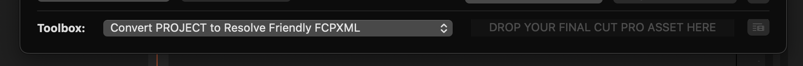
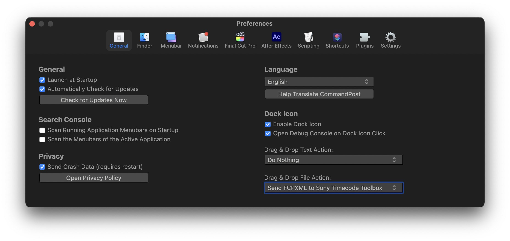

# Toolboxes

The BRAW Toolbox Workflow Extension contains a collection of "Toolbox" features to help get things in and out of Final Cut Pro.

---

### Convert PROJECT to Resolve Friendly FCPXML

To convert a project/timeline into something you can easily import into DaVinci Resolve (or other colour grading apps), you can drag your project from the Final Cut Pro Browser to the Toolbox at the bottom of the Workflow Extension.

This will create a new FCPXML, where it converts the BRAW Toolbox clips into normal BRAW clips.

---

### Convert PROJECT to Resolve Friendly FCPXML (via CP)

This works the same as above, but instead of prompting you for a filename, it'll send the processed FCPXML directly to CommandPost for processing.

The main use-case of this feature is if you're using both BRAW files and Sony MP4s with incorrect timecode, as you can send straight to CommandPost's Sony Timecode Toolbox.

For this to work, you need to make sure you select **Send FCPXML to Sony Timecode Toolbox** in the **Drag & Drop File Action** dropdown in the **General** section of CommandPost's Preferences.

