# Troubleshooting

### Is my Mac fast enough to play BRAW files?

You can use the free **Blackmagic RAW Speed Test** to check if your system's GPU is fast enough to play BRAW files.

> [:icon-desktop-download: You can download on the Mac App Store here.](https://apps.apple.com/us/app/blackmagic-raw-speed-test/id1466185689?mt=12)

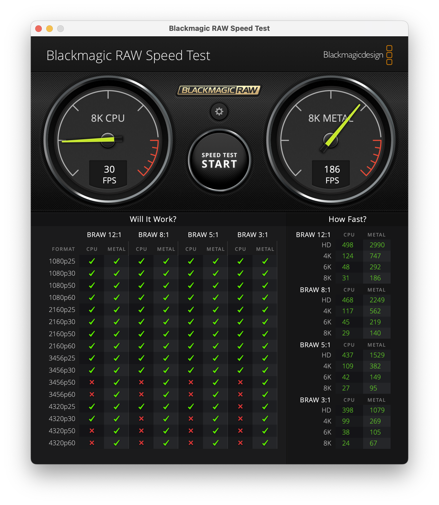

You can use the free **Blackmagic Disk Speed Test** to check if your hard drive is fast enough to keep up with BRAW files.

> [You can download on the Mac App Store here.](https://apps.apple.com/au/app/blackmagic-disk-speed-test/id425264550?mt=12)

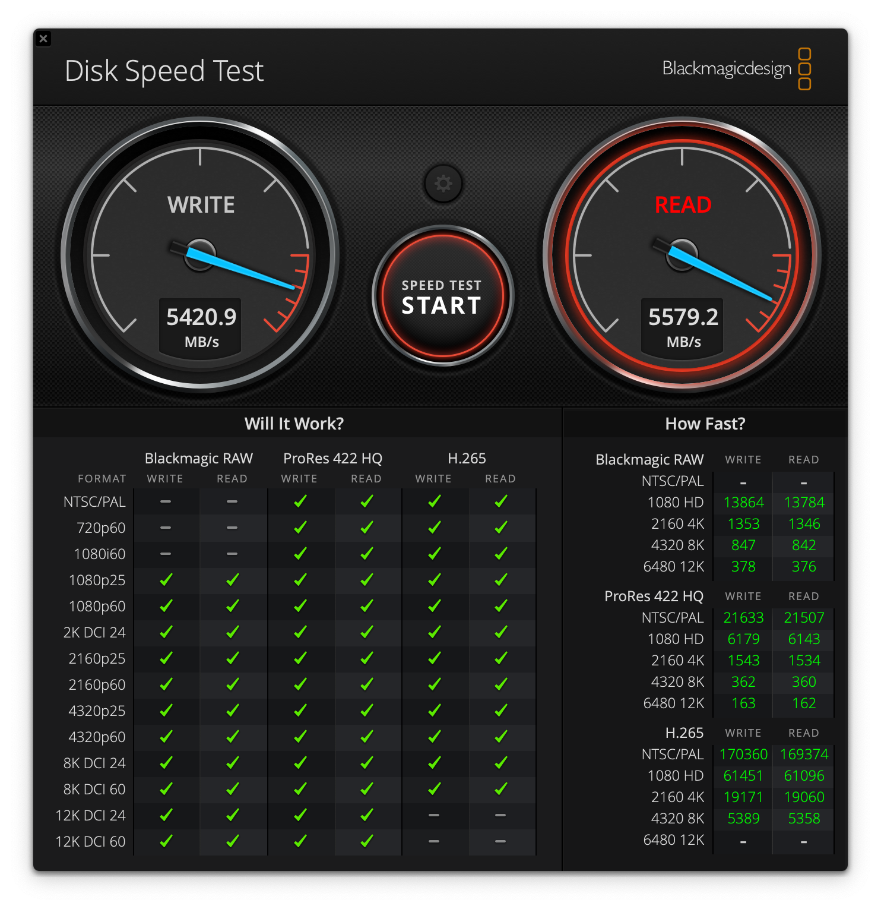

You can use the free **Blackmagic RAW Player** to see how your system performs playing back your BRAW files.

> [You can download on the Mac App Store here.](https://apps.apple.com/us/app/blackmagic-raw-player/id1435415804?mt=12)

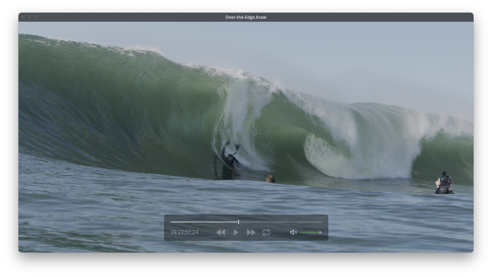

---

### Why can't I adjust the Custom Gamma Controls?

You can only adjust the Custom Gamma Controls if you select the **Blackmagic Design Custom** Gamma option.

---

### Why can't I adjust the RAW metadata within Final Cut Pro?

You absolutely can - that's the big benefit of BRAW Toolbox. You can even keyframe the ISO, Exposure, Color Temp, Tint and all the Custom Gamma Controls.

As explained in the [Installation](https://brawtoolbox.io/installation/) section, you can only access the BRAW Toolbox effect from WITHIN the Synchronised Clip or Multicam Clip.

Why this is the case, is explained in more detail in the [How does it work](https://brawtoolbox.io/faq/#how-does-it-work) FAQ.

For example, if you have imported the below clips as Synchronised Clips:

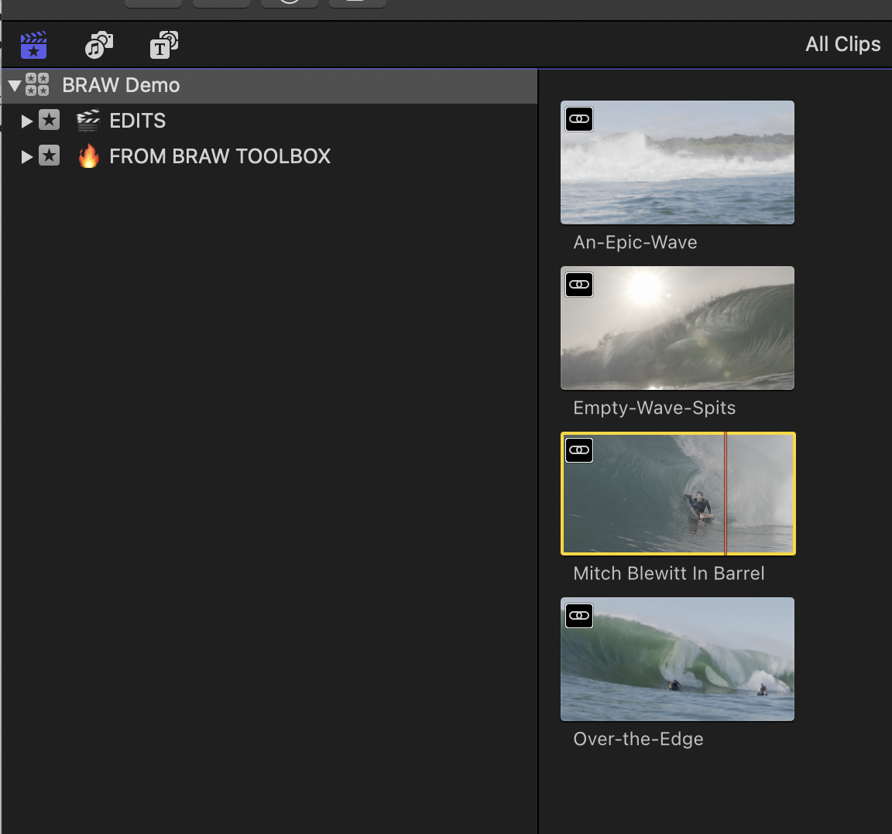

If you then double click on one of those clips in the Browser, it will open the clip in the timeline.

You'll see a black clip on the Primary Storyline, which is your BRAW footage. Click that clip, then in the Effects Inspector you can access the BRAW Toolbox controls.

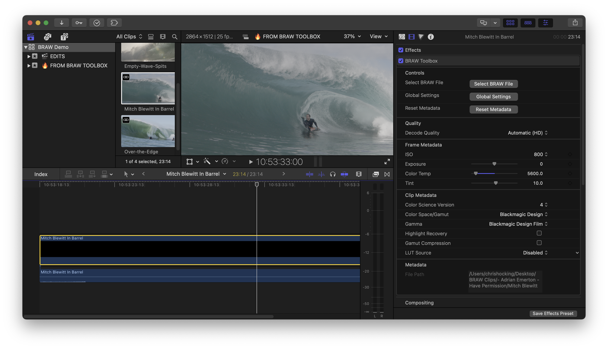

The same logic applies to clips already in the project/timeline. If it's a Synchronised Clip, you can double click on it to access the clip that contains the BRAW Toolbox effect.

Keep in mind that when you import a Synchronised Clip from the Browser to a Project, Final Cut Pro creates a new instance of that clip - so if you modify the RAW controls in the browser instance, it won't update in the individual timeline instances.

This is standard Final Cut Pro behaviour - and nothing to do with BRAW Toolbox.

However, if you've ticked **Create Multicam Clips** within the **Settings** button in the BRAW Toolbox Workflow Extension, it will create Synchronised Clips WITHIN a Multicam Clip, so that you can modify the Synchronised Clip, and any changes will ripple across all instances of the Multicam Clip.

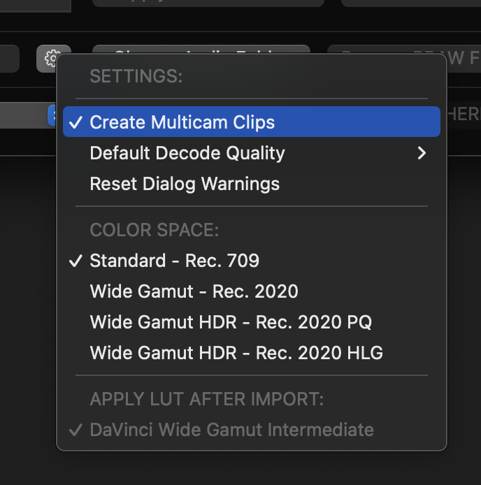

---

### BRAW Toolbox Workflow Extension doesn't appear in Final Cut Pro?

Sometimes macOS can be a bit temperamental with System Extensions, including Workflow Extensions.

If you can't see BRAW Toolbox in the Workflow Extension button or menu bar, you can try:

1. Make sure you've installed all the Motion Templates, Metadata View and LUTs as per the [Installation Instructions](https://brawtoolbox.io/installation/).
2. Restart your Mac.
3. [Trash Final Cut Pro Preferences](https://support.apple.com/en-au/HT203477) by holding down **COMMAND + OPTION** when launching Final Cut Pro, and clicking **Delete Preferences**.

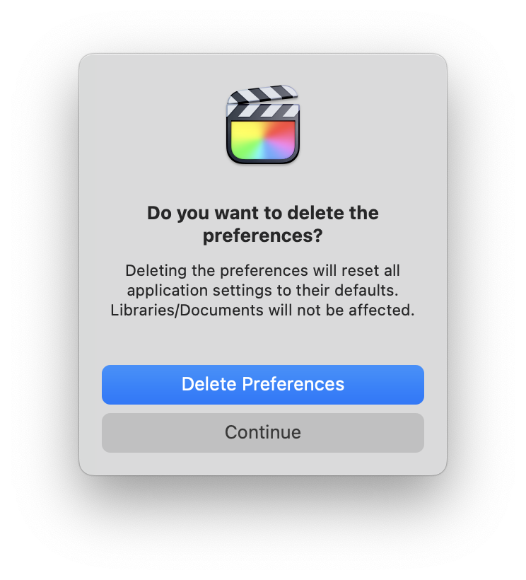

4. Delete Final Cut Pro and reinstall it from the App Store.

If none of those things fix it, please post an issue [here](https://github.com/latenitefilms/BRAWToolbox/issues).

---

### "The effect ID is invalid"

If you see an error message saying "The effect ID is invalid" when trying to import from the BRAW Toolbox Workflow Extension to Final Cut Pro, it means that the FxPlug4 Filter is not being detected by Final Cut Pro.

You can try:

1. Make sure you've installed all the Motion Templates, Metadata View and LUTs as per the [Installation Instructions](https://brawtoolbox.io/installation/).
2. Restart your Mac.
3. [Trash Final Cut Pro Preferences](https://support.apple.com/en-au/HT203477) by holding down **COMMAND + OPTION** when launching Final Cut Pro, and clicking **Delete Preferences**.


4. Delete Final Cut Pro and reinstall it from the App Store.
5. If none of the above fix the issue, you can try entering the below command into macOS Terminal, to see if macOS is detecting the FxPlug4 correctly.

```
pluginkit -mv -p FxPlug | grep "BRAW Toolbox"
```

You should see something like this:

```
com.latenitefilms.BRAWToolbox.Renderer(1.1)	FE230AC8-E59F-4BF6-B49F-A64E27067712	2023-02-03 00:29:14 +0000	/Applications/BRAW Toolbox.app/Contents/PlugIns/BRAW Toolbox Renderer.pluginkit
```

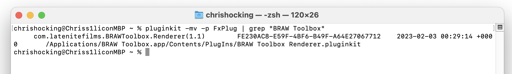

You can also try completely [uninstall BRAW Toolbox](https://brawtoolbox.io/uninstall/) and reinstall from the Mac App Store.

If things are still not working, please post an issue [here](https://github.com/latenitefilms/BRAWToolbox/issues).

---

### Bad Frames in the Final Cut Pro Browser

Generally speaking Final Cut Pro seems to work better with Multicam Clips, as opposed to Synchronised Clips. We're currently working with the Final Cut Pro team to find out why.

We suggest ticking the **Create Multicam Clips** option in the BRAW Toolbox Workflow Extension settings before importing BRAW clips into Final Cut Pro.


We recommend only using Synchronised Clips if you need to sync to dual system audio, using something like [Sync-N-Link](https://apps.apple.com/us/app/sync-n-link-x/id517599985?mt=12).

In rare instances in the Final Cut Pro Browser you might see black frames, or red error message frames in the thumbnails of BRAW Toolbox clips.


This is generally because Final Cut Pro has an outdated thumbnail cache, or something went wrong when creating the thumbnails.

This is a Final Cut Pro bug, rather than anything specifically wrong with BRAW Toolbox.

In Filmstrip mode, try changing the time slider from **All** to **½s** and see if that kicks Final Cut Pro back into gear.

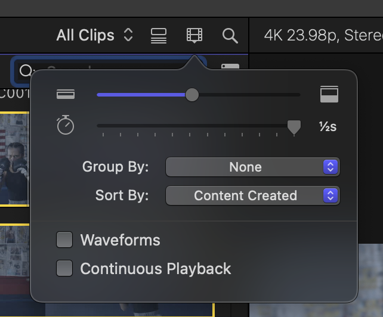

If all the frames look correctly in **½s** view, but incorrect when you change back to **All** it most likely means your thumbnail cache is corrupt, and Final Cut Pro isn't updating it.

To try and fix this, you can close Final Cut Pro, right click on the Library in Finder and select **Show Package Contents**, then within the problem Event folder, go into the **Render Files** folder, and delete the **Thumbnail Media** folder.

When you start Final Cut Pro again, this will force it to re-generate the thumbnails, and hopefully this time, it works correctly.

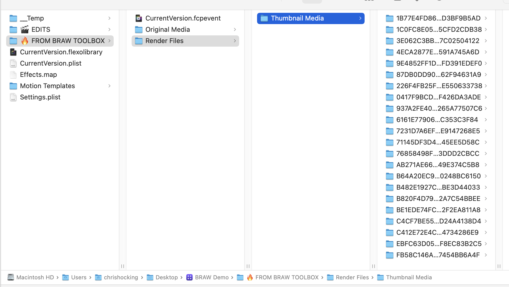

You can also try explicitly granting BRAW Toolbox sandbox access to the drive that contains your footage.

This means that BRAW Toolbox won't have to resolve the security-scoped bookmarks for each file, which can have a minor performance improvement, that might help with thumbnail creation.

If you select a BRAW Toolbox effect in the Final Cut Pro Inspector, you can click the **Global Settings** button to access a **Grant Sandbox Access** menu item.

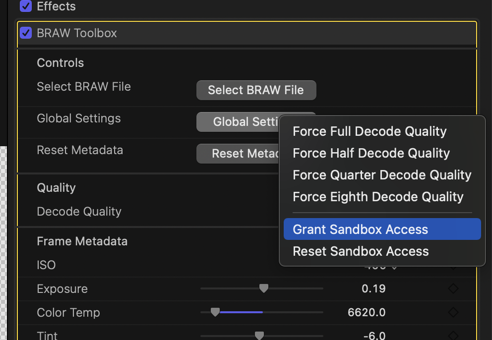

---

### Failed to install Motion Template, Metadata View or LUTs

In very rare instances you might run into problems installing the Motion Template, Metadata View, or LUTs.

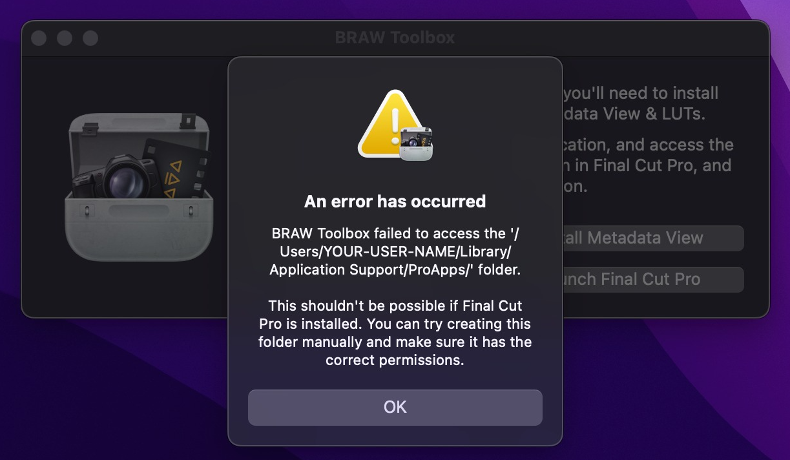

You can try completely [uninstall BRAW Toolbox](https://brawtoolbox.io/uninstall/) and reinstall from the Mac App Store.

Alternatively, please close BRAW Toolbox, then open the `Terminal` app:

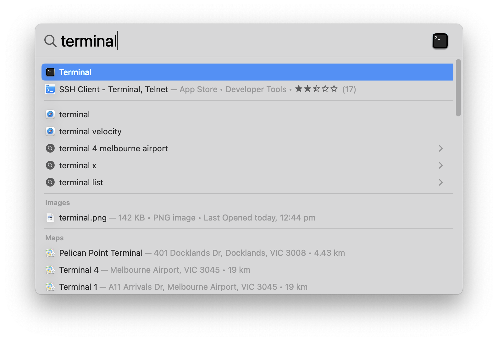

...then execute the following command:

```
/usr/bin/defaults delete com.latenitefilms.BRAWToolbox
```

This will delete all the BRAW Toolbox preferences.

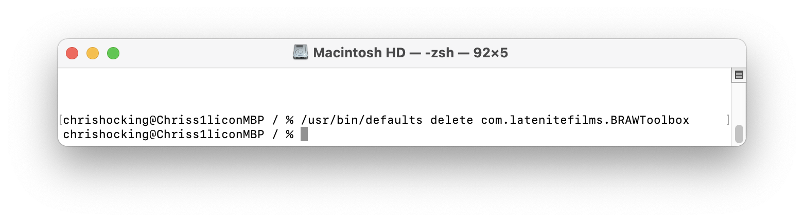

Alternatively, if you don't feel comfortable opening opening up `Terminal` then you can manually delete this file at the Finder level:

`/Users/YOUR-USER-NAME-GOES-HERE/Library/Containers/com.latenitefilms.BRAWToolbox/Data/Library/Preferences/com.latenitefilms.BRAWToolbox.plist`

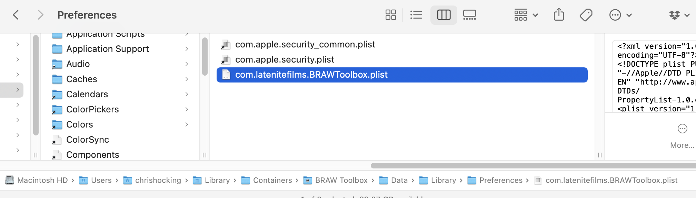

Try running the BRAW Toolbox application again, and be careful to follow [these exact steps](https://brawtoolbox.io/installation/), making sure you don't accidentally change the folders when prompted to **Grant Permission**.

Specifically, you should install the **Motion Templates** first, then **Metadata View**, then **LUTs**.

When prompted for access to the **Movies** folder, you should **Grant Access** with the **Movies** folder selected:

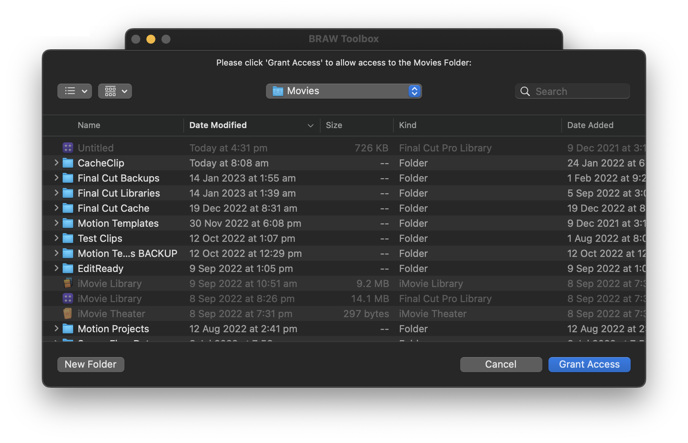

When prompted for access to the **ProApps** folder, you should **Grant Access** with the **ProApps** folder selected:

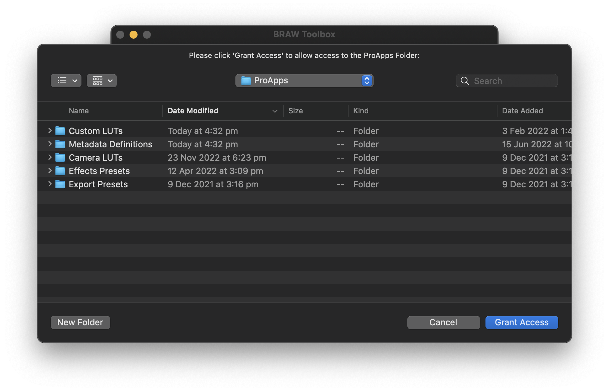

The **LUTs** are installed in the same location as the **Metadata View**, so you won't be requested to **Grant Access** again.

If this still doesn't work, please [post an issue](https://github.com/latenitefilms/brawtoolbox/issues) and we'll try and resolve your specific problem.

---

### I've run into a bug. Where can I find the log files?

You can access your User Library, by clicking on your **Desktop**, then holding down **OPTION** as you click the **Go** menu item in Finder. A **Library** option will appear:

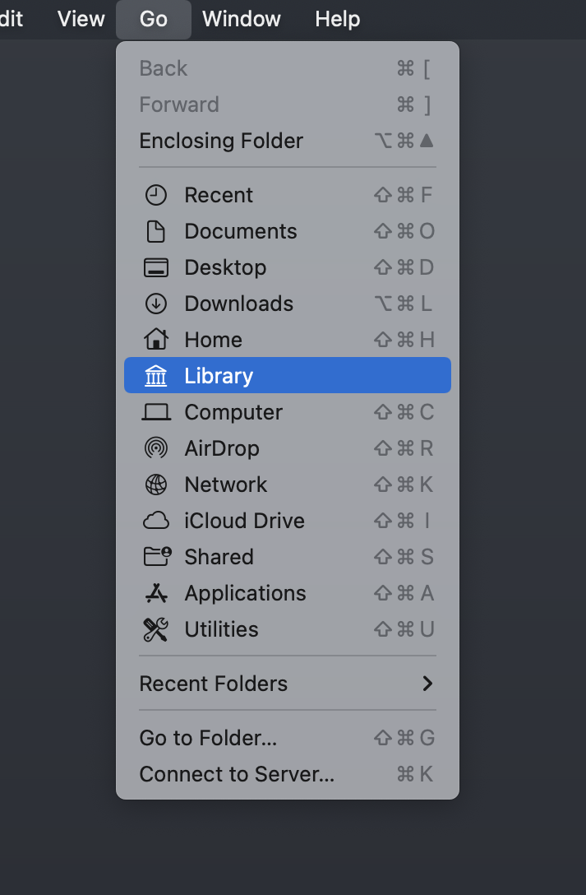

Once you have your User Library open, you can find the log files here:

`/Users/YOUR-USER-NAME/Library/Group Containers/A5HDJTY9X5.com.latenitefilms.BRAWToolbox/Library/Application Support/`

Please create a ZIP file of this entire **Application Support** folder (by right-clicking and selecting the **Compress** menu item), so that we can review all of these log files:

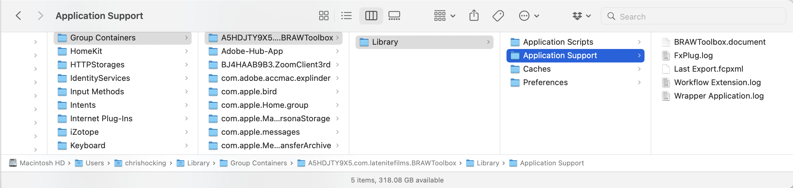

You can find any crash reports here:

`/Users/YOUR-USER-NAME/Library/Logs/DiagnosticReports`

Any crashes related to BRAW Toolbox will have **BRAW Toolbox** at the start of the filename.

There might also be crash logs in the **Retired** folder (these are crash logs that have already been sent to Apple):

`/Users/YOUR-USER-NAME/Library/Logs/DiagnosticReports/Retired`

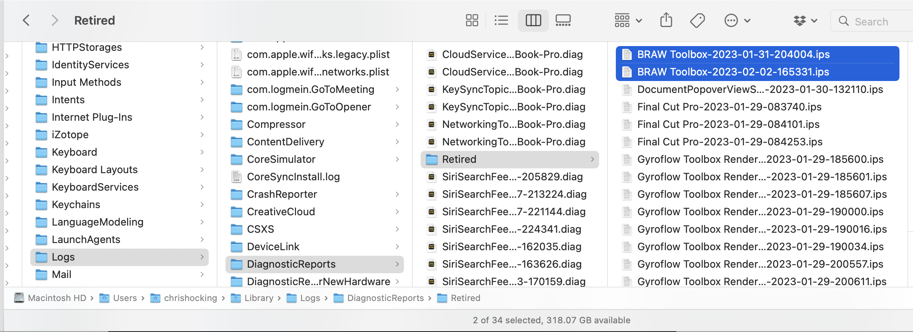

Again, please ZIP up all of these individual crash logs, so that we can review them all.

You can send the files to LateNite Films [here](https://latenitefilms.digitalpigeon.com) or [post an issue](https://github.com/latenitefilms/brawtoolbox/issues) with these files in a ZIP, and we'll try and resolve your specific problem.