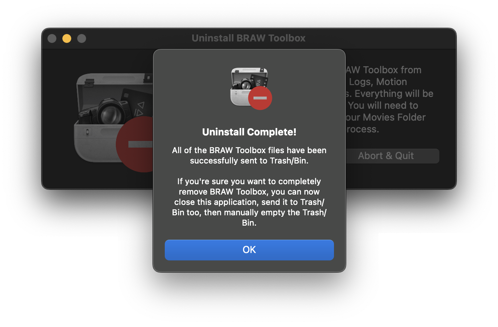

# Uninstall

If you're on Big Sur or Monterey, you can download an Uninstall tool [here](https://github.com/latenitefilms/BRAWToolbox/raw/main/uninstall/Uninstall%20BRAW%20Toolbox.zip).

Unfortunately due to increased security in macOS Ventura, this Uninstall tool doesn't work unless you give it **Full Disk Access**. This will be fixed in the future.

After downloading the above ZIP file, you can extract it to reveal the **Uninstall BRAW Toolbox** application.


Right click on the **Uninstall BRAW Toolbox** icon and select **Open**.


You'll be presented with a warning message. Click **Open** again.


You'll be presented with a final warning. Press the **Uninstall** button.


Once done, you should get a completion message.



---

### Manual Uninstall

After installation, the BRAW Toolbox files are contained within the following folders:

- `/Applications/BRAW Toolbox.app`
- `~/Library/Application Support/ProApps/Custom LUTs/BRAW Toolbox`
- `~/Library/Application Support/ProApps/Metadata Definitions/BRAW Toolbox.plist`
- `~/Library/Group Containers/A5HDJTY9X5.com.latenitefilms.BRAWToolbox`
- `~/Library/Containers/com.latenitefilms.BRAWToolbox`
- `~/Library/Containers/com.latenitefilms.BRAWToolbox.Renderer`
- `~/Library/Containers/com.latenitefilms.BRAWToolbox.WorkflowExtension`
- `~/Movies/Motion Templates.localized/Effects.localized/BRAW Toolbox`

> **NOTE:** The `~` refers to your user folder, i.e. `/Users/YOUR-USER-NAME/`

You can use the below Bash script to completely uninstall BRAW Toolbox, or run each command individually in Terminal.

> **NOTE:** You will need to change **YOUR-USER-NAME** with your macOS user name.

```
#!/bin/bash

# Trash Preferences:
/usr/bin/defaults delete com.latenitefilms.BRAWToolbox
/usr/bin/defaults delete com.latenitefilms.BRAWToolbox.Renderer
/usr/bin/defaults delete com.latenitefilms.BRAWToolbox.WorkflowExtension

# Remove Preferences and Logs:
rm -R "/Users/YOUR-USER-NAME/Library/Group Containers/A5HDJTY9X5.com.latenitefilms.BRAWToolbox"
rm -R "/Users/YOUR-USER-NAME/Library/Containers/com.latenitefilms.BRAWToolbox"
rm -R "/Users/YOUR-USER-NAME/Library/Containers/com.latenitefilms.BRAWToolbox.Renderer"
rm -R "/Users/YOUR-USER-NAME/Library/Containers/com.latenitefilms.BRAWToolbox.WorkflowExtension"

# Remove Motion Templates:
rm -R "/Users/YOUR-USER-NAME/Movies/Motion Templates.localized/Effects.localized/BRAW Toolbox"

# Remove Metadata Views:
rm "/Users/YOUR-USER-NAME/Library/Application Support/ProApps/Metadata Definitions/BRAW Toolbox.plist"

# Remove LUTs:
rm -R "/Users/YOUR-USER-NAME/Library/Application Support/ProApps/Custom LUTs/BRAW Toolbox"

# Restart Preference Manager:
/usr/bin/killall cfprefsd
```