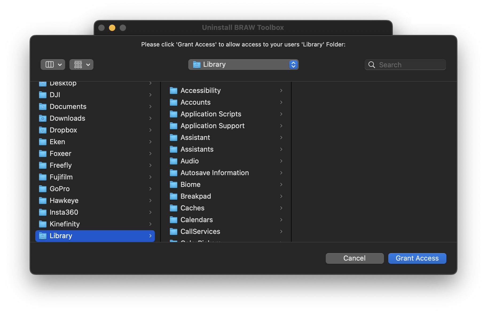

# Uninstall

You can download the Uninstall tool [here](https://github.com/latenitefilms/BRAWToolbox/raw/main/uninstall/Uninstall%20BRAW%20Toolbox.zip).

After downloading the above ZIP file, you can extract it to reveal the **Uninstall BRAW Toolbox** application.


Double click the **Uninstall BRAW Toolbox** icon to run the Uninstall Tool, then click **Remove BRAW Toolbox**.


You'll be presented with a window to grant access to your Movies folder. Click **Grant Access*:


You'll be presented with a window to grant access to your users Library folder. Click **Grant Access*:



Once done, you'll get a completed successfully message:


This remove all of the Preferences, Logs, Motion Templates, Metadata Views and LUTs from your system.

However, due to sandbox restrictions, it doesn't remove the **BRAW Toolbox.app** from your Applications folder. You should manually delete this.

Once done, you can now also move the **Uninstall BRAW Toolbox.app** and the downloaded ZIP file to Trash/Bin, and empty the Trash/Bin..

---

### Manual Uninstall

After installation, the BRAW Toolbox files are contained within the following folders:

- `/Applications/BRAW Toolbox.app`
- `~/Library/Application Support/ProApps/Custom LUTs/BRAW Toolbox`
- `~/Library/Application Support/ProApps/Metadata Definitions/BRAW Toolbox.plist`
- `~/Library/Group Containers/A5HDJTY9X5.com.latenitefilms.BRAWToolbox`
- `~/Library/Containers/com.latenitefilms.BRAWToolbox`
- `~/Library/Containers/com.latenitefilms.BRAWToolbox.Renderer`
- `~/Library/Containers/com.latenitefilms.BRAWToolbox.WorkflowExtension`
- `~/Movies/Motion Templates.localized/Effects.localized/BRAW Toolbox`

> **NOTE:** The `~` refers to your user folder, i.e. `/Users/YOUR-USER-NAME/`

You can use the below Bash script to completely uninstall BRAW Toolbox, or run each command individually in Terminal.

> **NOTE:** You will need to change **YOUR-USER-NAME** with your macOS user name.

```
#!/bin/bash

# Trash Preferences:
/usr/bin/defaults delete com.latenitefilms.BRAWToolbox
/usr/bin/defaults delete com.latenitefilms.BRAWToolbox.Renderer
/usr/bin/defaults delete com.latenitefilms.BRAWToolbox.WorkflowExtension

# Remove Preferences and Logs:
rm -R "/Users/YOUR-USER-NAME/Library/Group Containers/A5HDJTY9X5.com.latenitefilms.BRAWToolbox"
rm -R "/Users/YOUR-USER-NAME/Library/Containers/com.latenitefilms.BRAWToolbox"
rm -R "/Users/YOUR-USER-NAME/Library/Containers/com.latenitefilms.BRAWToolbox.Renderer"
rm -R "/Users/YOUR-USER-NAME/Library/Containers/com.latenitefilms.BRAWToolbox.WorkflowExtension"

# Remove Motion Templates:
rm -R "/Users/YOUR-USER-NAME/Movies/Motion Templates.localized/Effects.localized/BRAW Toolbox"

# Remove Metadata Views:
rm "/Users/YOUR-USER-NAME/Library/Application Support/ProApps/Metadata Definitions/BRAW Toolbox.plist"

# Remove LUTs:
rm -R "/Users/YOUR-USER-NAME/Library/Application Support/ProApps/Custom LUTs/BRAW Toolbox"

# Restart Preference Manager:
/usr/bin/killall cfprefsd
```