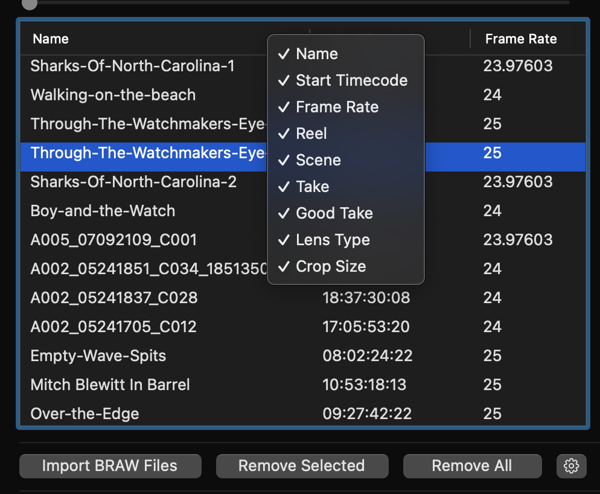
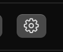

# Workflow Extension

The BRAW Toolbox Workflow Extension is basically the equivalent of the **Media Import** window in Final Cut Pro.

This is where we import our BRAW clips into Final Cut Pro, and do any initial changes to the RAW parameters.

The Workflow Extension has different areas:

---

### Player

The player is where you can preview BRAW footage prior to importing.

As it's really just a preview, it will always decode at Eighth Quality for fast performance.

The bottom left timecode value is the start timecode of the currently selected clip.

The bottom right timecode is the current timecode of the player.

There are buttons to:

- Go to the first frame
- Go to the previous frame
- Play/stop the player
- Go to the next frame
- Go to the last frame

---

### File List

The file list is where you import clips, and select the clip you want to work with.

To import BRAW clips you can either drag-and-drop from Finder, or press the **Import BRAW Files** button.

If you want to remove a single clip, you can click **Remove Selected**.

If you want to remove all clips, you can click **Remove All**.

These buttons only remove the clips from the File List - they don't delete anything at the Finder level.

You can right click on the columns to show/hide specific columns, and you can drag columns around to change the order.

---

### Settings

The Settings button opens up a menu with various options:

**Create Multicam Clips** allows you to create Multicam clips instead of Synchronised Clips.

**Default Decode Quality** allows you to set a default decode quality of newly imported clips. Changing this setting won't change any of the clips you have already imported.

**Reset Dialog Warnings** will reset all the dialogs where you might have clicked **Do not show this message again**.

The **COLOR SPACE** options allow you to set the Color Space that best matches your Final Cut Pro Library & Event. This will also change how things look in the Workflow Extension Player.

**APPLY LUT AFTER IMPORT** are special options that will automagically apply LUTs to clips AFTER you import into Final Cut Pro. You won't see the affects of these LUTs in the Workflow Extension Player. You can learn more about this in the [HDR Workflow](https://brawtoolbox.io/hdr-workflow/) section.

---

### Inspector

The Inspector is similar to Final Cut Pro - it's where you adjust BRAW parameters.

You can only adjust one clip at the time. This is a deliberate decision, as each BRAW clip could have different "read only" parameters and ranges, so selecting multiple clips at once becomes incredibly complex.

**Decode Quality** allows you to select the decode quality of the BRAW files. There are two "special" options that you won't find in DaVinci Resolve, **Automatic (HD)** and **Automatic (UltraHD)**. These options will automagically pick the best decode quality based on the HD or UltraHD delivery.

If you're working in a HD timeline, we recommend just using the **Automatic (HD)** option, then using the **Force Full Quality** option in the Final Cut Pro Inspector when you're ready to export or render at full quality.

The checkboxes next to each parameter are selection options (as opposed to something that might enable/disable something).

For example, you can use them to reset multiple parameters, like in the below screenshot:

With **Exposure** and **Color Temp** checked, clicking the **Reset Checked Items** will reset these two parameters for only the selected clip.

You can use the **Copy Checked Items** to copy the parameter values of the checked clips. You can then use the **Paste Checked Items** to paste those values to whichever items you've ticked.

You can also **Save Preset**, which will only save the checked items, and recall them with the **Load Preset** button.

The **Apply Checked To All** button allows you to apply all the checked items to ALL the clips in the File List.

The **Uncheck All** button will uncheck all of the selection checkboxes.

---

### Toolbox

You can learn more about the Toolbox Features [here](https://brawtoolbox.io/toolbox/).